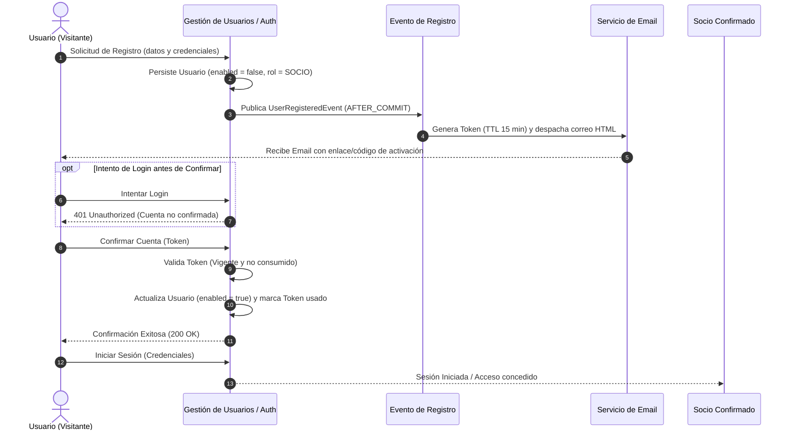
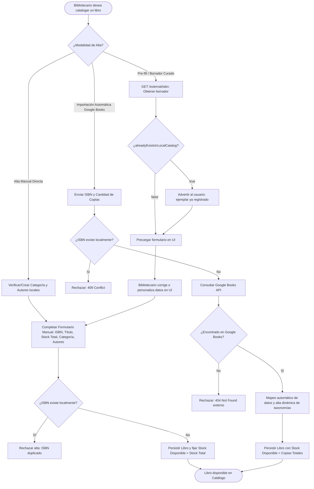
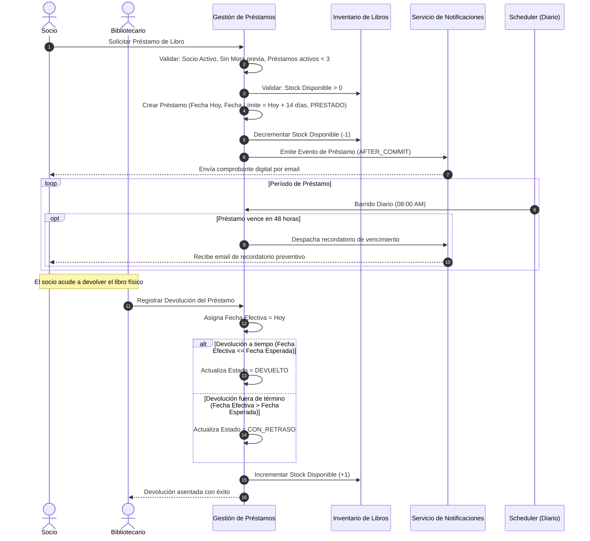
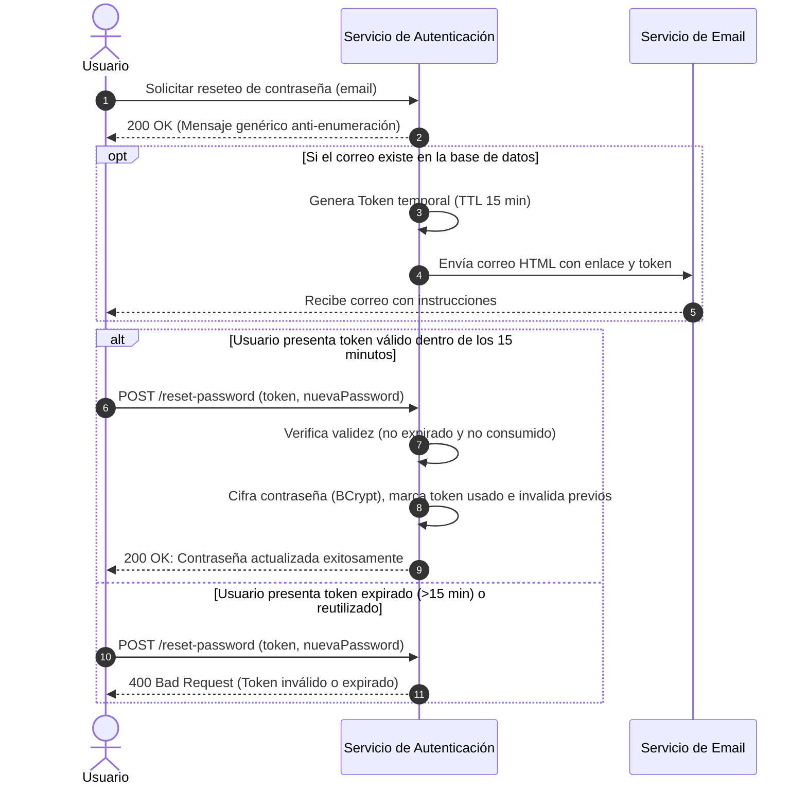
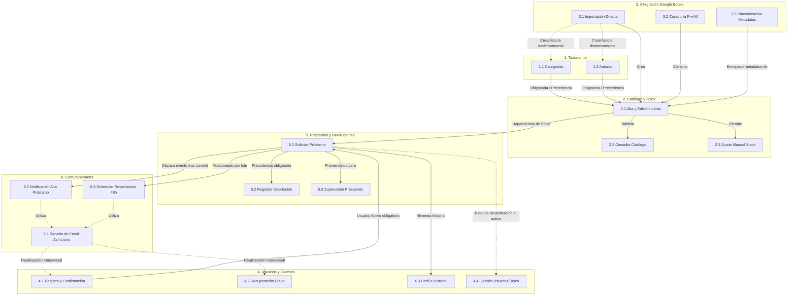

# Especificación Funcional Consolidada del Sistema (Feature Set)

---

## 1. Información del documento

| Atributo | Detalle |
| :--- | :--- |
| **Nombre del documento** | Especificación Funcional Consolidada del Sistema de Gestión de Biblioteca (`FEATURE-SET.md`) |
| **Propósito** | Consolidar, estructurar y sintetizar la especificación funcional completa del sistema como producto, abstrayendo detalles de implementación técnica y estableciendo una fuente única y consistente de verdad funcional. |
| **Alcance** | Todas las capacidades, reglas de negocio, flujos operativos, actores y entidades especificadas en los documentos de requisitos funcionales del proyecto. |
| **Fuente de información** | Directorio `.features/` (18 especificaciones funcionales: 17 especificaciones modulares `feat-*.md` y 1 catálogo de requisitos globales `features.md`). |
| **Estado del documento** | Aprobado / Consolidado para Referencia Funcional |
| **Fecha de generación** | 16 de septiembre de 2026 |
| **Principio de trazabilidad** | Cada capacidad, funcionalidad y regla de negocio incluida en este documento mantiene trazabilidad directa y bidireccional hacia sus especificaciones de origen en `.features/`. |

---

## 2. Descripción general del producto

El **Sistema de Gestión de Biblioteca** es una solución integral orientada a la administración del catálogo bibliográfico, la gestión de socios y personal, el control estricto del ciclo de vida de préstamos y devoluciones físicas de ejemplares, y la automatización de comunicaciones operativas mediante notificaciones electrónicas.

### Necesidad y problema que aborda
Las instituciones bibliotecarias requieren administrar con alta fidelidad existencias de libros físicos, controlar la rotación de ejemplares entre sus socios, prevenir pérdidas o retenciones indebidas y optimizar el tiempo de carga de nuevos volúmenes. El sistema resuelve estas necesidades mediante:
1. **Control estricto de existencias físicas:** Diferenciación en tiempo real entre inventario total e inventario efectivamente disponible para retiro.
2. **Gobernanza del ciclo de préstamo:** Verificación de políticas de elegibilidad de socios (ausencia de mora, límite de préstamos simultáneos) y cálculo sistemático de plazos de devolución con detección automática de retrasos.
3. **Agilidad en la catalogación:** Incorporación automatizada y curaduría de metadatos bibliográficos a partir de fuentes externas de referencia global (Google Books API).
4. **Comunicaciones automatizadas y preventivas:** Emisión de comprobantes digitales de préstamo y recordatorios periódicos previos al vencimiento para mitigar devoluciones fuera de término.

---

## 3. Alcance funcional

### 3.1. Capacidades Incluidas
* **Gestión de Autores y Categorías:** Registro, edición, catalogación, búsqueda filtrada y eliminación condicionada a la no existencia de libros vinculados.
* **Gestión de Catálogo de Libros y Control de Stock:** Alta manual, edición preservando compromisos de stock prestado, búsqueda multicriterio combinada con disponibilidad, y ajuste manual atómico de inventario físico.
* **Integración con Servicios Externos (Google Books):** Importación directa de libros a partir de ISBN y stock inicial, previsualización de borradores para edición previa a la persistencia (pre-fill / draft), y sincronización no destructiva de metadatos complementarios (portadas, descripciones).
* **Gestión de Cuentas, Usuarios y Seguridad:** Registro de socios con confirmación obligatoria vía token temporal por correo electrónico (15 minutos), restablecimiento seguro de contraseñas olvidadas con protección anti-enumeración, consulta restringida de perfil e historial propio de préstamos, y administración de estados de cuenta (activación/desactivación) y asignación de roles.
* **Ciclo de Vida de Préstamos y Devoluciones:** Solicitud y registro de préstamos bajo validación de cupo, stock y estado de mora; registro de devoluciones por personal bibliotecario con cálculo automático de puntualidad (`DEVUELTO` vs `CON_RETRASO`) y reintegro atómico de existencias; supervisión y monitoreo de préstamos activos y vencidos.
* **Comunicaciones Automatizadas:** Despacho asíncrono y tolerante a fallos de correos electrónicos en formato HTML, notificación instantánea de alta de préstamo y barrido diario automático de préstamos próximos a vencer en 48 horas.

### 3.2. Aspectos No Especificados / Fuera de Alcance Conocido
* **Cobro de multas, tarifas o penalizaciones económicas:** No se encuentra especificado en las fuentes analizadas ningún módulo de caja, tarifas monetarias o pasarelas de pago asociadas a retrasos.
* **Períodos explícitos de suspensión o inhabilitación temporal:** Aunque en `features.md` se menciona de forma tentativa la posibilidad de penalizar o bloquear a un usuario con retraso, las reglas concretas, duración de sanciones o estados de penalización formal no se encuentran especificados en las fuentes analizadas.
* **Reservas previas de libros sin stock disponible:** No se encuentra especificada en las fuentes analizadas la capacidad de reservar un ejemplar en espera cuando el stock disponible es igual a cero.
* **Renovación o extensión del plazo de préstamo:** No se encuentra especificado en las fuentes analizadas un procedimiento funcional para prorrogar la fecha límite de devolución de un préstamo activo.
* **Manejo de múltiples sucursales físicas o estanterías:** El sistema asume un repositorio de inventario único y centralizado. No se encuentran especificadas sedes, ubicaciones físicas, pasillos ni estanterías.

---

## 4. Actores y tipos de usuario

| Actor | Descripción | Responsabilidades funcionales |
| :--- | :--- | :--- |
| **Socio** | Usuario regular registrado y activo de la biblioteca. | Consultar el catálogo público de libros; solicitar préstamos de libros para consumo personal; consultar sus propios datos y su historial de préstamos; recibir comprobantes digitales y recordatorios de vencimiento por correo electrónico. |
| **Bibliotecario / Administrador** | Personal operativo con privilegios de gestión sobre el sistema y el inventario físico. | Administrar el catálogo de autores y categorías; dar de alta, editar y ajustar stock de libros; importar y sincronizar libros desde Google Books; registrar préstamos en nombre de socios; registrar devoluciones de libros físicos; supervisar préstamos demorados; administrar el estado y rol de las cuentas de usuario. |
| **Usuario No Autenticado (Visitante)** | Persona que interactúa con la plataforma sin contar con una sesión activa. | Registrarse en el sistema completando el formulario de alta; confirmar su cuenta mediante el token de verificación recibido por correo; solicitar el restablecimiento de su contraseña ante olvido o extravío. |
| **Sistema (Scheduler / Procesos Automáticos)** | Actor interno y desatendido que ejecuta rutinas programadas y tareas reactivas de infraestructura. | Ejecución diaria de la tarea programada de recordatorios de devolución a 48 horas; despacho asíncrono de correos electrónicos transaccionales; generación de eventos tras confirmación de préstamos y registros. |

### Matriz de Roles y Niveles de Permisos

| Capacidad / Operación | Visitante | Socio | Bibliotecario | Sistema |
| :--- | :---: | :---: | :---: | :---: |
| Registro de usuario y confirmación de cuenta | Sí | N/A | N/A | Sí (asíncrono) |
| Recuperación de contraseña | Sí | Sí | Sí | Sí (asíncrono) |
| Consulta y filtrado de catálogo de libros | No | Sí | Sí | No |
| Consulta de perfil e historial propio | No | Sí (Self-only) | Sí (Self-only) | No |
| Solicitud de préstamo propio | No | Sí | Sí | No |
| Solicitud de préstamo en nombre de un tercero | No | No | Sí | No |
| Registro de devoluciones de libros | No | No | Sí | No |
| ABM de categorías y autores | No | No | Sí | No |
| Alta, edición y ajuste de stock de libros | No | No | Sí | No |
| Importación, pre-fill y sincronización Google Books | No | No | Sí | No |
| Supervisión de préstamos activos y demorados | No | No | Sí | No |
| Activación/desactivación y cambio de roles de usuarios | No | No | Sí | No |
| Ejecución de recordatorios diarios (Scheduler) | No | No | No | Sí |

---

## 5. Mapa funcional del sistema

```text
Sistema de Gestión de Biblioteca
├── 1. Gestión de Autores y Categorías
│   ├── 1.1. ABM de Categorías de Libros
│   └── 1.2. ABM de Autores
│
├── 2. Gestión de Catálogo de Libros y Stock
│   ├── 2.1. Alta y Edición de Libros
│   ├── 2.2. Búsqueda y Filtrado del Catálogo
│   └── 2.3. Ajuste Manual de Stock
│
├── 3. Integración Externa y Curaduría (Google Books)
│   ├── 3.1. Importación Directa desde Google Books
│   ├── 3.2. Previsualización y Curaduría de Borradores (Pre-fill)
│   └── 3.3. Sincronización y Enriquecimiento de Metadatos
│
├── 4. Gestión de Usuarios, Autenticación y Cuentas
│   ├── 4.1. Registro y Confirmación de Cuenta por Email
│   ├── 4.2. Restablecimiento de Contraseña
│   ├── 4.3. Consulta de Perfil e Historial Personal
│   └── 4.4. Administración de Usuarios y Roles
│
├── 5. Gestión de Préstamos y Devoluciones (Lógica Core)
│   ├── 5.1. Solicitud y Registro de Préstamos
│   ├── 5.2. Registro de Devolución e Inspección de Plazos
│   └── 5.3. Supervisión y Monitoreo de Préstamos
│
└── 6. Comunicaciones y Notificaciones Automatizadas
    ├── 6.1. Despacho Asíncrono de Correos Electrónicos
    ├── 6.2. Notificación Instantánea de Alta de Préstamo
    └── 6.3. Tarea Programada de Recordatorio de Devolución (48hs)
```

---

## 6. Feature Set

### Capacidad 1: Gestión de Autores y Categorías
**Propósito:** Proveer las capacidades taxonómicas necesarias para clasificar las obras del catálogo bibliográfico y atribuir la autoría de los libros.

#### Funcionalidad 1.1: ABM de Categorías de Libros
* **Descripción:** Creación, consulta paginada, modificación y eliminación de categorías de libros (ej. Ciencia Ficción, Historia, Programación).
* **Actor(es):** Bibliotecario.
* **Objetivo:** Organizar las temáticas del catálogo bibliográfico mediante una taxonomía controlada.
* **Precondiciones:** Usuario autenticado con rol `BIBLIOTECARIO`.
* **Flujo funcional:**
  1. El bibliotecario define un nombre y descripción para la categoría.
  2. El sistema valida que el nombre sea obligatorio y no se encuentre registrado previamente.
  3. Para listar, se retorna una vista paginada (por defecto 15 registros).
  4. Para eliminar, el sistema verifica que la categoría no posea libros asociados.
* **Resultado esperado:** Categoría persistida o actualizada; en caso de eliminación, el registro es removido solo si no posee dependencias activas.
* **Reglas de negocio relevantes:** `BR-001`, `BR-002`, `BR-003`.
* **Restricciones:** No es posible eliminar una categoría que tenga uno o más libros vinculados.
* **Dependencias:** Ninguna.
* **Features de origen:** `feat-01-categorias.md`, `features.md` (RF01).

#### Funcionalidad 1.2: ABM de Autores
* **Descripción:** Registro, edición, consulta con filtros parciales/combinados y baja de autores de libros.
* **Actor(es):** Bibliotecario (administración); Socio / Bibliotecario (consulta).
* **Objetivo:** Mantener el registro biográfico y nominal de los autores vinculados a las obras de la biblioteca.
* **Precondiciones:** Usuario con permisos de administración para alta/modificación/baja.
* **Flujo funcional:**
  1. El bibliotecario ingresa nombre, apellido y atributos opcionales (nacionalidad, fecha de nacimiento).
  2. El sistema asigna un identificador público único e inmutable.
  3. Los usuarios pueden consultar y filtrar autores por nombre, apellido o nacionalidad.
  4. Al intentar eliminar un autor, el sistema verifica que no tenga libros asociados.
* **Resultado esperado:** Autor registrado o actualizado; en eliminación, se rechaza si posee obras registradas.
* **Reglas de negocio relevantes:** `BR-004`, `BR-005`, `BR-006`.
* **Restricciones:** No se puede borrar un autor con obras registradas en el catálogo. El identificador público es inmutable.
* **Dependencias:** Ninguna.
* **Features de origen:** `feat-02-autores.md`, `features.md` (RF02).

---

### Capacidad 2: Gestión de Catálogo de Libros y Stock
**Propósito:** Gestionar el inventario de libros disponibles en la biblioteca, permitiendo altas, ediciones, consultas y ajustes físicos de existencias.

#### Funcionalidad 2.1: Alta y Edición de Libros
* **Descripción:** Registro de un nuevo libro en el catálogo local asociándolo a una categoría y a uno o más autores, y edición posterior de sus atributos.
* **Actor(es):** Bibliotecario.
* **Objetivo:** Incorporar nuevas obras al catálogo e inicializar o mantener su inventario físico.
* **Precondiciones:** La categoría y todos los autores indicados deben existir previamente en el sistema.
* **Flujo funcional:**
  1. El bibliotecario ingresa ISBN, título, stock total inicial, categoría y lista de autores.
  2. El sistema valida la unicidad del ISBN y la existencia previa de la categoría y autores.
  3. Al crearse, el sistema inicializa automáticamente el `stockDisponible` igual al `stockTotal`.
  4. En edición de datos, si se modifica el stock total, el nuevo valor no puede ser inferior a las copias que estén prestadas en ese momento.
* **Resultado esperado:** Libro creado o modificado con inventario inicializado o recalculado consistentemente.
* **Reglas de negocio relevantes:** `BR-007`, `BR-008`, `BR-009`, `BR-010`.
* **Restricciones:** ISBN único globalmente. Al crear no se permite ingresar `stockDisponible`. En edición, $\text{Nuevo Stock Total} \ge \text{Copias Prestadas}$.
* **Dependencias:** Requiere la existencia de al menos una Categoría (Capacidad 1.1) y un Autor (Capacidad 1.2).
* **Features de origen:** `feat-03-libros.md`, `features.md` (RF03).

#### Funcionalidad 2.2: Búsqueda y Filtrado del Catálogo
* **Descripción:** Consulta del catálogo de libros con capacidades de filtrado dinámico por texto de título, categoría, autor o disponibilidad inmediata de copias físicas.
* **Actor(es):** Socio, Bibliotecario.
* **Objetivo:** Localizar libros de interés y constatar si disponen de ejemplares físicos para retiro.
* **Precondiciones:** Usuario autenticado en el sistema.
* **Flujo funcional:**
  1. El usuario introduce criterios opcionales (título parcial insensible a mayúsculas/minúsculas, categoría, autor, y/o bandera de solo disponibles).
  2. El sistema aplica los filtros sobre el catálogo y retorna los resultados de forma paginada (por defecto 10 elementos ordenados por título).
* **Resultado esperado:** Conjunto paginado de libros coincidentes con su información descriptiva y stock disponible.
* **Reglas de negocio relevantes:** `BR-011`.
* **Restricciones:** Si se solicita `soloDisponibles = true`, se excluyen obras con `stockDisponible = 0`.
* **Dependencias:** Requiere libros dados de alta en el catálogo.
* **Features de origen:** `feat-04-catalogo.md`, `features.md` (RF04).

#### Funcionalidad 2.3: Ajuste Manual de Stock
* **Descripción:** Modificación directa del inventario total de un libro para asentar compras, deterioros, extravíos o donaciones de ejemplares físicos.
* **Actor(es):** Bibliotecario.
* **Objetivo:** Reflejar la realidad del inventario físico sin alterar los compromisos de préstamos vigentes.
* **Precondiciones:** Rol `BIBLIOTECARIO`. El libro debe existir.
* **Flujo funcional:**
  1. El bibliotecario especifica el nuevo stock total deseado para un libro.
  2. El sistema calcula las copias actualmente en préstamo ($\text{stockTotal} - \text{stockDisponible}$).
  3. Valida que el nuevo total sea mayor o igual a las copias prestadas.
  4. Actualiza el `stockTotal` y recalcula atómicamente el `stockDisponible`.
* **Resultado esperado:** Inventario actualizado y stock disponible recalculado de forma coherente.
* **Reglas de negocio relevantes:** `BR-010`, `BR-012`.
* **Restricciones:** Operación atómica. No se puede fijar un stock total menor a las copias prestadas.
* **Dependencias:** Libro existente (Capacidad 2.1).
* **Features de origen:** `feat-05-stock.md`, `features.md` (RF05).

---

### Capacidad 3: Integración Externa y Curaduría (Google Books)
**Propósito:** Acelerar el proceso de catalogación y enriquecer los metadatos bibliográficos mediante el consumo de la API de Google Books.

#### Funcionalidad 3.1: Importación Directa desde Google Books
* **Descripción:** Alta automática de un libro en la biblioteca enviando únicamente su código ISBN y el número de copias físicas a ingresar.
* **Actor(es):** Bibliotecario / Administrador.
* **Objetivo:** Crear libros rápidamente sin completar manualmente fichas bibliográficas extensas.
* **Precondiciones:** Rol con permisos de administración. El ISBN no debe existir en la base de datos local.
* **Flujo funcional:**
  1. El usuario envía el ISBN y la cantidad de copias deseadas (mínimo 1).
  2. El sistema comprueba que el ISBN no esté ya registrado localmente.
  3. Consulta a Google Books de forma no bloqueante.
  4. Si existe, mapea metadatos, asocia o da de alta dinámicamente autores y categorías faltantes, e inicializa stock disponible igual a copias totales.
* **Resultado esperado:** Libro persistido en el catálogo local con stock asignado y metadatos externos integrados.
* **Reglas de negocio relevantes:** `BR-008`, `BR-013`, `BR-014`.
* **Restricciones:** Si el ISBN ya existe localmente, se rechaza la importación directa. Si no se encuentra en Google Books, se informa la ausencia.
* **Dependencias:** Disponibilidad de conectividad con Google Books API.
* **Features de origen:** `feat-16-google-books-api.md`.

#### Funcionalidad 3.2: Previsualización y Curaduría de Borradores (Pre-fill)
* **Descripción:** Consulta preliminar de metadatos de un libro en Google Books mediante su ISBN para precargar un formulario editable antes de su persistencia.
* **Actor(es):** Bibliotecario / Administrador.
* **Objetivo:** Revisar, corregir o complementar la información bibliográfica antes de registrar el libro en la base de datos local.
* **Precondiciones:** Rol administrativo.
* **Flujo funcional:**
  1. El usuario ingresa un ISBN para previsualización.
  2. El sistema consulta a Google Books y construye un borrador temporal con título, autores, editorial, descripción y portada.
  3. Evalúa si el ISBN ya existe en el catálogo local y marca el indicador `alreadyExistsInLocalCatalog`.
  4. El bibliotecario visualiza el borrador, efectúa ajustes manuales en la interfaz y procede al alta definitiva a través del canal de creación manual.
* **Resultado esperado:** Borrador entregado a la interfaz sin persistencia en base de datos.
* **Reglas de negocio relevantes:** `BR-017`.
* **Restricciones:** Operación de solo lectura sobre la fuente externa; no crea registros por sí misma.
* **Dependencias:** Google Books API.
* **Features de origen:** `feat-18-prefill-draft-import-google-books.md`.

#### Funcionalidad 3.3: Sincronización y Enriquecimiento de Metadatos
* **Descripción:** Actualización selectiva de metadatos faltantes o desactualizados en libros ya existentes en el catálogo local utilizando la información de Google Books.
* **Actor(es):** Bibliotecario / Administrador.
* **Objetivo:** Autocompletar campos vacíos (ej. portadas o descripciones) sin perder datos locales de inventario ni comprometer préstamos.
* **Precondiciones:** Libro existente con ISBN registrado.
* **Flujo funcional:**
  1. El bibliotecario solicita la sincronización para un libro identificado.
  2. El sistema recupera los metadatos desde Google Books usando el ISBN.
  3. Aplica estrategia de actualización no destructiva: solo rellena campos que se encuentren nulos o vacíos a nivel local.
  4. Si se solicita de forma forzada (`force = true`), sobrescribe metadatos informativos (título, descripción, editorial, portada).
  5. Bajo cualquier modalidad, los valores de stock e historial de préstamos se mantienen estrictamente inalterados.
* **Resultado esperado:** Metadatos del libro enriquecidos o actualizados sin impacto en el inventario.
* **Reglas de negocio relevantes:** `BR-015`, `BR-016`.
* **Restricciones:** Queda terminantemente prohibido alterar el stock o el historial de préstamos en la sincronización.
* **Dependencias:** Libro existente en catálogo (Capacidad 2.1) y conectividad con Google Books API.
* **Features de origen:** `feat-17-sync-google-books.md`.

---

### Capacidad 4: Gestión de Usuarios, Autenticación y Cuentas
**Propósito:** Gobernar el acceso a la plataforma, salvaguardar la identidad de los usuarios, controlar el ciclo de vida de las cuentas y asegurar la privacidad de la información personal.

#### Funcionalidad 4.1: Registro y Confirmación de Cuenta por Email
* **Descripción:** Alta de nuevos usuarios en el sistema e imposición de activación obligatoria de cuenta mediante un token de verificación temporal enviado por correo.
* **Actor(es):** Usuario No Autenticado (Visitante), Sistema.
* **Objetivo:** Verificar la autenticidad de las direcciones de correo de los socios y evitar altas fraudulentas.
* **Precondiciones:** Correo electrónico no registrado previamente.
* **Flujo funcional:**
  1. El visitante completa el formulario de registro; la cuenta nace inactiva (`enabled = false`, rol `SOCIO` por defecto).
  2. Tras guardar la cuenta, el sistema genera un token de confirmación unívoco con validez de 15 minutos.
  3. Se despacha de forma asíncrona un correo HTML con el enlace/código de activación.
  4. El usuario no puede iniciar sesión hasta confirmar su cuenta.
  5. El usuario envía el token; si es válido y no expiró, la cuenta pasa a activa (`enabled = true`), el token se marca como consumido y se invalidan tokens anteriores.
  6. Si el token expiró, el usuario dispone de una opción para solicitar el reenvío de un nuevo token.
* **Resultado esperado:** Cuenta de usuario creada y activada tras verificar su email.
* **Reglas de negocio relevantes:** `BR-018`, `BR-019`, `BR-021`.
* **Restricciones:** No se permite el acceso al sistema a usuarios no confirmados. Los tokens caducan a los 15 minutos y son de uso único.
* **Dependencias:** Servicio Asíncrono de Envío de Emails (Capacidad 6.1).
* **Features de origen:** `feat-15-confirmar-cuenta.md`, `features.md` (RF06).

#### Funcionalidad 4.2: Restablecimiento de Contraseña
* **Descripción:** Mecanismo de autoservicio para la recuperación de contraseñas olvidadas mediante un token de un solo uso despachado al correo electrónico.
* **Actor(es):** Usuario (No autenticado / Socio / Bibliotecario), Sistema.
* **Objetivo:** Permitir al usuario recuperar el acceso a su cuenta garantizando protección contra enumeración de cuentas.
* **Precondiciones:** Ninguna (accesible públicamente).
* **Flujo funcional:**
  1. El usuario ingresa su dirección de correo solicitando recuperación.
  2. El sistema responde siempre con éxito genérico para evitar determinar si el correo existe o no en la base de datos (anti-enumeración).
  3. Si el correo existe, genera un token con 15 minutos de vigencia y lo despacha por correo HTML.
  4. El usuario presenta el token y su nueva contraseña.
  5. El sistema valida el token (vigencia y no utilizado), almacena la contraseña cifrada, marca el token como consumido e invalida cualquier otro token pendiente del usuario.
* **Resultado esperado:** Contraseña restablecida de forma segura.
* **Reglas de negocio relevantes:** `BR-019`, `BR-020`, `BR-021`.
* **Restricciones:** Tokens con vigencia estricta de 15 minutos y consumo único.
* **Dependencias:** Servicio Asíncrono de Envío de Emails (Capacidad 6.1).
* **Features de origen:** `feat-14-cambiar-contrasenia.md`.

#### Funcionalidad 4.3: Consulta de Perfil e Historial Personal
* **Descripción:** Consulta de datos personales y visualización del historial completo de préstamos solicitados por el usuario en sesión.
* **Actor(es):** Socio, Bibliotecario autenticado (Self-only).
* **Objetivo:** Proveer transparencia al usuario sobre sus datos y permitirle dar seguimiento a los libros solicitados, estados y plazos de devolución.
* **Precondiciones:** Usuario autenticado en el sistema.
* **Flujo funcional:**
  1. El usuario invoca la consulta de perfil personal.
  2. El sistema extrae la identidad directamente del contexto de seguridad de la sesión, sin requerir identificadores en la URL.
  3. Se retornan los datos del perfil y la lista de préstamos asociados ordenados descendentemente por fecha de préstamo, con soporte de paginación.
* **Resultado esperado:** Datos del usuario autenticado y su historial de préstamos detallando títulos, fechas y estados (`PRESTADO`, `DEVUELTO`, `CON_RETRASO`).
* **Reglas de negocio relevantes:** `BR-024`.
* **Restricciones:** Principio estricto de auto-consulta (un socio no puede consultar el perfil ni préstamos de otro socio).
* **Dependencias:** Requiere sesión de usuario activa.
* **Features de origen:** `feat-06-perfil.md`, `features.md` (RF07).

#### Funcionalidad 4.4: Administración de Usuarios y Roles
* **Descripción:** Gestión administrativa de los usuarios de la plataforma para habilitar/deshabilitar cuentas y modificar roles asignados.
* **Actor(es):** Bibliotecario.
* **Objetivo:** Controlar el acceso al sistema y asignar responsabilidades operativas.
* **Precondiciones:** Rol `BIBLIOTECARIO`.
* **Flujo funcional:**
  1. El bibliotecario selecciona un usuario para modificar su estado activo o su rol (`SOCIO` $\leftrightarrow$ `BIBLIOTECARIO`).
  2. Si intenta desactivar la cuenta, el sistema valida que el usuario no posea préstamos pendientes de devolución (`PRESTADO` o `CON_RETRASO`).
  3. El sistema aplica autoprotección: rechaza cualquier intento de un bibliotecario de desactivar su propia cuenta o rebajar su propio rol.
* **Resultado esperado:** Estado o rol del usuario actualizado.
* **Reglas de negocio relevantes:** `BR-022`, `BR-023`.
* **Restricciones:** Un usuario desactivado no puede autenticarse ni solicitar préstamos. No se puede desactivar a un usuario en mora o con libros en su poder. Un bibliotecario no puede autobloquearse.
* **Dependencias:** Usuarios registrados en el sistema.
* **Features de origen:** `feat-07-admin-usuarios.md`, `features.md` (RF08).

---

### Capacidad 5: Gestión de Préstamos y Devoluciones (Lógica Core)
**Propósito:** Regular la salida y retorno físico de ejemplares, garantizando el cumplimiento de las políticas de préstamo de la biblioteca y el control de mora.

#### Funcionalidad 5.1: Solicitud y Registro de Préstamos
* **Descripción:** Emisión de un nuevo préstamo de un libro físico a favor de un socio.
* **Actor(es):** Socio (solicitud propia), Bibliotecario (registro en nombre de un socio).
* **Objetivo:** Registrar formalmente el retiro de un libro asignando un plazo límite de devolución e impactando las existencias disponibles.
* **Precondiciones:**
  - El socio debe estar activo (`activo = true`).
  - El libro debe poseer `stockDisponible > 0`.
  - El socio no debe superar el límite de 3 préstamos activos (`PRESTADO` o `CON_RETRASO`).
  - El socio no debe poseer ningún préstamo vencido sin devolver (cero tolerancia a mora).
* **Flujo funcional:**
  1. Se especifica el libro y el socio beneficiario.
  2. El sistema valida las 4 precondiciones de negocio mencionadas.
  3. Si todas se cumplen, genera el registro de préstamo con fecha de emisión (hoy), fecha esperada de devolución (hoy + 14 días corridos) y estado `PRESTADO`.
  4. Decrementa atómicamente en 1 el `stockDisponible` del libro.
  5. Dispara el evento de dominio para emisión de comprobante por correo.
* **Resultado esperado:** Préstamo registrado con éxito y stock disponible del libro decrementado en una unidad.
* **Reglas de negocio relevantes:** `BR-025`, `BR-026`, `BR-027`, `BR-028`, `BR-029`, `BR-030`, `BR-035`.
* **Restricciones:** Límite infranqueable de 3 préstamos simultáneos. Bloqueo inmediato ante préstamos vencidos.
* **Dependencias:** Usuario activo (Capacidad 4), Libro con stock (Capacidad 2).
* **Features de origen:** `feat-08-registrar-prestamo.md`, `features.md` (RF09).

#### Funcionalidad 5.2: Registro de Devolución e Inspección de Plazos
* **Descripción:** Asentamiento del retorno material de un ejemplar prestado, verificación de cumplimiento de la fecha esperada y restitución del inventario físico disponible.
* **Actor(es):** Bibliotecario.
* **Objetivo:** Finalizar el préstamo, computar la puntualidad del socio y reincorporar la copia al inventario disponible para futuros préstamos.
* **Precondiciones:** Rol `BIBLIOTECARIO`. El préstamo debe encontrarse en estado `PRESTADO`.
* **Flujo funcional:**
  1. El bibliotecario ingresa el identificador del préstamo a devolver.
  2. El sistema verifica que el préstamo esté pendiente de devolución.
  3. Registra la fecha efectiva de devolución como el día actual.
  4. Compara la fecha efectiva con la fecha esperada de devolución:
      - Si `fechaDevolucionEfectiva` $\le$ `fechaDevolucionEsperada` $\implies$ `Estado` = `DEVUELTO`.
      - Si `fechaDevolucionEfectiva` $>$ `fechaDevolucionEsperada` $\implies$ `Estado` = `CON_RETRASO`.
  5. Incrementa atómicamente en 1 el `stockDisponible` del libro correspondiente.
* **Resultado esperado:** Préstamo cerrado con su estado final asentado y stock disponible incrementado en 1.
* **Reglas de negocio relevantes:** `BR-030`, `BR-031`, `BR-032`, `BR-033`.
* **Restricciones:** Operación exclusiva del personal bibliotecario. No se puede devolver un préstamo ya cerrado.
* **Dependencias:** Préstamo activo previo (Capacidad 5.1).
* **Features de origen:** `feat-09-devolucion.md`, `features.md` (RF10).

#### Funcionalidad 5.3: Supervisión y Monitoreo de Préstamos
* **Descripción:** Panel de control y consulta de préstamos para supervisar los libros en circulación y auditar aquellos que han excedido la fecha límite de devolución.
* **Actor(es):** Bibliotecario.
* **Objetivo:** Detectar situaciones de mora, contactar a socios morosos y auditar el historial de operaciones de la biblioteca.
* **Precondiciones:** Rol `BIBLIOTECARIO`. Acceso restringido para socios (`403 Forbidden`).
* **Flujo funcional:**
  1. El bibliotecario consulta el listado aplicando filtros (por estado, solo atrasados o por socio).
  2. El sistema procesa la consulta paginada ordenando preferentemente por fecha esperada de devolución ascendente (los más próximos a vencer o con más días de atraso primero).
  3. Cada ítem expone datos del préstamo, socio, libro, fechas y cómputo de días de atraso.
* **Resultado esperado:** Vista estructurada y paginada de supervisión operativa.
* **Reglas de negocio relevantes:** `BR-031`.
* **Restricciones:** Exclusivo para bibliotecarios.
* **Dependencias:** Préstamos registrados en el sistema.
* **Features de origen:** `feat-10-gestion-prestamos.md`, `features.md` (RF11).

---

### Capacidad 6: Comunicaciones y Notificaciones Automatizadas
**Propósito:** Proporcionar un canal de contacto confiable y desatendido hacia los usuarios mediante correos electrónicos formateados, asegurando no comprometer los tiempos ni transacciones del sistema principal.

#### Funcionalidad 6.1: Despacho Asíncrono de Correos Electrónicos
* **Descripción:** Servicio transversal y reutilizable para el envío no bloqueante de correos electrónicos en formato HTML.
* **Actor(es):** Sistema (Infraestructura transversal).
* **Objetivo:** Despachar comunicaciones transaccionales sin degradar los tiempos de respuesta de la API ni comprometer las transacciones de negocio ante fallas del servidor de correo.
* **Precondiciones:** Conectividad SMTP configurada.
* **Flujo funcional:**
  1. Un proceso o servicio de negocio solicita el despacho de un correo HTML.
  2. La ejecución se delega a un hilo de ejecución secundario (asíncrono).
  3. Si el servidor de correo experimenta fallos o indisponibilidad, el error se captura y registra en bitácora sin propagar excepción ni causar rollback en la transacción original.
* **Resultado esperado:** Correo enviado al destinatario sin impacto en el rendimiento de la API.
* **Reglas de negocio relevantes:** `BR-034`.
* **Restricciones:** Principio failsafe: un fallo de correo jamás revierte operaciones de negocio (ej. el préstamo se confirma aunque el correo falle).
* **Dependencias:** Servidor SMTP externo.
* **Features de origen:** `feat-11-email.md`.

#### Funcionalidad 6.2: Notificación Instantánea de Alta de Préstamo
* **Descripción:** Envío automático de un comprobante digital en HTML al correo del socio inmediatamente después de registrarse un préstamo a su nombre.
* **Actor(es):** Sistema (en beneficio del Socio).
* **Objetivo:** Otorgar al socio una constancia formal del préstamo con la fecha límite estipulada para la devolución.
* **Precondiciones:** Transacción del préstamo confirmada exitosamente en base de datos (`AFTER_COMMIT`).
* **Flujo funcional:**
  1. Tras confirmarse el alta del préstamo en BD, se emite el evento de creación.
  2. El componente receptor compone la plantilla HTML con el nombre del socio, título del libro, fecha de emisión y fecha límite de devolución (+14 días).
  3. Despacha el mensaje utilizando el servicio asíncrono de correos.
* **Resultado esperado:** Socio notificado con su comprobante digital de préstamo.
* **Reglas de negocio relevantes:** `BR-029`, `BR-034`, `BR-035`.
* **Restricciones:** El correo solo se emite si la transacción de BD concluyó con éxito total.
* **Dependencias:** Solicitud de préstamo confirmada (Capacidad 5.1) y Servicio de Correo (Capacidad 6.1).
* **Features de origen:** `feat-12-notificar-alta-prestamo.md`.

#### Funcionalidad 6.3: Tarea Programada de Recordatorio de Devolución (48hs)
* **Descripción:** Proceso por lotes ejecutado diariamente de forma automática para recordar a los socios la proximidad del vencimiento de sus préstamos.
* **Actor(es):** Sistema (Scheduler diario).
* **Objetivo:** Prevenir la morosidad y alertar proactivamente a los usuarios dos días antes de que expire el plazo acordado.
* **Precondiciones:** Existencia de préstamos en estado `PRESTADO` cuyo vencimiento ocurra exactamente a las +48 horas.
* **Flujo funcional:**
  1. El scheduler se ejecuta en forma diaria (ej. 08:00 AM).
  2. Consulta en base de datos todos los préstamos no devueltos cuya `fechaDevolucionEsperada` coincida con la fecha correspondiente a +48 horas desde la ejecución.
  3. Procesa el lote enviando una notificación individual a cada socio mediante el servicio de email.
  4. Opera con tolerancia a fallas individual: el fallo en el envío de un correo no interrumpe el procesamiento del resto del lote.
* **Resultado esperado:** Correos de alerta emitidos para todos los préstamos identificados en el rango objetivo.
* **Reglas de negocio relevantes:** `BR-034`, `BR-036`.
* **Restricciones:** Ignora préstamos ya devueltos. Proceso idempotente y tolerante a fallos locales de envío.
* **Dependencias:** Préstamos activos (Capacidad 5.1) y Servicio de Correo (Capacidad 6.1).
* **Features de origen:** `feat-13-recordatorio-devolucion.md`.

---

## 7. Flujos funcionales principales

### Flujo 1: Ciclo de Vida del Usuario (Registro, Activación y Autenticación)
* **Objetivo:** Incorporar a un nuevo socio a la biblioteca asegurando la validez de su casilla de correo electrónico.
* **Actor:** Usuario No Autenticado (Visitante) y Sistema.
* **Funcionalidades involucradas:** 4.1 (Registro y Confirmación), 6.1 (Despacho de Emails).
* **Condiciones relevantes:** Cuenta nace con `enabled = false`; token con TTL de 15 minutos.



---

### Flujo 2: Incorporación de Libros al Catálogo (Manual vs Google Books)
* **Objetivo:** Ingresar nuevos ejemplares al catálogo bibliográfico de la institución.
* **Actor:** Bibliotecario y Sistema.
* **Funcionalidades involucradas:** 1.1, 1.2, 2.1, 3.1, 3.2.
* **Condiciones relevantes:** ISBN único; coexistencia de flujo manual, flujo directo y flujo asistido (pre-fill).



---

### Flujo 3: Ciclo de Vida del Préstamo (Solicitud, Notificación, Recordatorio y Devolución)
* **Objetivo:** Gestionar íntegramente la tenencia temporal de una copia física desde su retiro hasta su reintegración al stock.
* **Actor:** Socio, Bibliotecario y Sistema.
* **Funcionalidades involucradas:** 2.2, 5.1, 5.2, 6.1, 6.2, 6.3.
* **Condiciones relevantes:** Stock disponible > 0, usuario activo, max 3 préstamos, sin morosidad previa; 14 días corridos de plazo.



---

### Flujo 4: Recuperación de Acceso (Olvido de Contraseña)
* **Objetivo:** Permitir al usuario reestablecer sus credenciales de acceso de forma segura.
* **Actor:** Usuario y Sistema.
* **Funcionalidades involucradas:** 4.2, 6.1.
* **Condiciones relevantes:** Protección anti-enumeración; token con TTL de 15 minutos y consumo único.



---

## 8. Reglas de negocio consolidadas

| ID | Regla de Negocio | Dominio | Features de Origen |
| :--- | :--- | :--- | :--- |
| **BR-001** | **Unicidad de Nombre de Categoría:** El nombre de la categoría es único a nivel del sistema (comparación insensible a mayúsculas/minúsculas). No se admiten nombres repetidos. | Categorías | `feat-01-categorias.md` |
| **BR-002** | **Obligatoriedad de Nombre de Categoría:** El nombre de una categoría es mandatorio y no puede estar vacío ni compuesto únicamente por espacios en blanco. | Categorías | `feat-01-categorias.md` |
| **BR-003** | **Integridad Referencial en Eliminación de Categorías:** Queda prohibida la eliminación de cualquier categoría que posea uno o más libros asociados en el catálogo. | Categorías | `feat-01-categorias.md` |
| **BR-004** | **Atributos Obligatorios de Autor:** El registro de un autor exige obligatoriamente su nombre y apellido. La nacionalidad y fecha de nacimiento son de carga opcional. | Autores | `feat-02-autores.md` |
| **BR-005** | **Inmutabilidad del Identificador Público:** Los identificadores públicos generados por el sistema (UUID) son inmutables tras su asignación y no pueden alterarse en actualizaciones. | General / Autores | `feat-02-autores.md` |
| **BR-006** | **Integridad Referencial en Eliminación de Autores:** No se puede dar de baja un autor si este se encuentra vinculado como creador de uno o más libros en el sistema. | Autores | `feat-02-autores.md` |
| **BR-007** | **Requisitos de Alta de Libros:** Para dar de alta un libro se debe indicar obligatoriamente título, ISBN, stock total inicial, una categoría válida y al menos un autor registrado. | Libros | `feat-03-libros.md` |
| **BR-008** | **Unicidad Global de ISBN:** El código normalizado ISBN debe ser único en todo el catálogo de la biblioteca; se deniegan altas duplicadas del mismo código. | Libros | `feat-03-libros.md`, `feat-16-google-books-api.md` |
| **BR-009** | **Inicialización Coherente de Stock:** Al crearse un libro, el stock disponible se iguala automáticamente al stock total. No se permite fijar stock disponible en la creación. | Libros | `feat-03-libros.md`, `feat-16-google-books-api.md` |
| **BR-010** | **Protección de Stock Comprometido:** La modificación del stock total de un libro (vía edición general o ajuste manual) no puede establecer un total inferior a la cantidad de copias actualmente prestadas ($\text{Stock Total} \ge \text{Prestados}$). | Libros / Stock | `feat-03-libros.md`, `feat-05-stock.md` |
| **BR-011** | **Consulta Paginada y Filtros Combinables:** La búsqueda de catálogo es pública para usuarios autenticados, soporta paginación por defecto y permite combinar filtros de título, categoría, autor y disponibilidad. | Catálogo | `feat-04-catalogo.md` |
| **BR-012** | **Ajuste Atómico de Stock:** El ajuste de existencias físicas es exclusivo del Bibliotecario y recalcula atómicamente el stock disponible preservando las copias prestadas. | Stock | `feat-05-stock.md` |
| **BR-013** | **Prevención de Duplicados en Importación:** La importación automática mediante Google Books valida previamente que el ISBN no exista localmente; si existe, rechaza la operación con conflicto. | Integración Externa | `feat-16-google-books-api.md` |
| **BR-014** | **Alta Dinámica de Taxonomías Externas:** Al importar un libro desde Google Books, los autores o categorías no registrados previamente en la base local se vinculan o crean dinámicamente. | Integración Externa | `feat-16-google-books-api.md` |
| **BR-015** | **Enriquecimiento No Destructivo de Metadatos:** La sincronización con Google Books actualiza por defecto únicamente campos locales nulos o vacíos, salvo invocación con sobrescritura forzada explícita (`force = true`). | Integración Externa | `feat-17-sync-google-books.md` |
| **BR-016** | **Inviolabilidad de Dominio Local en Sincronización:** La sincronización de metadatos jamás modifica existencias físicas (stock total o disponible), identificadores ni historial de préstamos. | Integración Externa | `feat-17-sync-google-books.md` |
| **BR-017** | **Detección Previa en Borrador de Importación:** La consulta de previsualización (pre-fill) entrega un DTO no persistido e informa explícitamente mediante una bandera si el ISBN ya forma parte del catálogo local. | Integración Externa | `feat-18-prefill-draft-import-google-books.md` |
| **BR-018** | **Estado Inactivo Previo a Confirmación:** Todo usuario registrado nace con estado inactivo (`enabled = false`) y no puede autenticarse hasta confirmar su cuenta por correo. | Usuarios / Seguridad | `feat-15-confirmar-cuenta.md` |
| **BR-019** | **Vigencia y Consumo Único de Tokens:** Los tokens de confirmación de cuenta y restablecimiento de contraseña poseen una vigencia estricta de 15 minutos y quedan anulados tras su primer uso. | Usuarios / Seguridad | `feat-14-cambiar-contrasenia.md`, `feat-15-confirmar-cuenta.md` |
| **BR-020** | **Protección Anti-Enumeración de Cuentas:** Las solicitudes de restablecimiento de contraseña responden con un mensaje de éxito genérico independientemente de si el correo existe o no en el sistema. | Seguridad | `feat-14-cambiar-contrasenia.md` |
| **BR-021** | **Cifrado Seguro de Contraseñas:** Las contraseñas deben persistirse codificadas mediante algoritmo seguro unidireccional (BCrypt). Al cambiar clave se invalidan tokens previos. | Seguridad | `feat-14-cambiar-contrasenia.md` |
| **BR-022** | **Autoprotección de Cuenta del Bibliotecario:** Un bibliotecario no puede desactivar su propia cuenta de usuario ni degradar su propio rol, impidiendo situaciones de autobloqueo administrativo. | Administración | `feat-07-admin-usuarios.md` |
| **BR-023** | **Prohibición de Baja con Préstamos Activos:** No se puede desactivar la cuenta de un usuario que posea préstamos en estado `PRESTADO` o `CON_RETRASO`. | Administración | `feat-07-admin-usuarios.md` |
| **BR-024** | **Privacidad del Perfil (Self-Only):** La consulta del perfil e historial de préstamos extrae la identidad del contexto de seguridad de la sesión; un socio únicamente puede acceder a sus propios datos. | Usuarios / Perfil | `feat-06-perfil.md` |
| **BR-025** | **Elegibilidad por Estado Activo:** Solo los socios cuya cuenta se encuentre en estado activo (`activo = true` / `enabled = true`) están autorizados a solicitar o recibir préstamos. | Préstamos | `feat-08-registrar-prestamo.md` |
| **BR-026** | **Disponibilidad Factual de Ejemplares:** Un préstamo solo puede originarse si el libro requerido tiene una existencia física disponible estrictamente mayor a cero (`stockDisponible > 0`). | Préstamos | `feat-08-registrar-prestamo.md`, `features.md` |
| **BR-027** | **Límite Máximo de Préstamos Simultáneos:** Un socio no puede poseer más de 3 préstamos activos en simultáneo (sumatoria de préstamos en estado `PRESTADO` y `CON_RETRASO`). | Préstamos | `feat-08-registrar-prestamo.md`, `features.md` |
| **BR-028** | **Cero Tolerancia a Vencimientos Pendientes (Mora):** Se deniega de forma inmediata cualquier solicitud de préstamo si el socio posee al menos un préstamo cuya fecha esperada ya venció y no ha sido devuelto. | Préstamos | `feat-08-registrar-prestamo.md` |
| **BR-029** | **Plazo Estandarizado de Préstamo:** El plazo de devolución asignado por defecto a todo nuevo préstamo es de 14 días corridos contados a partir de la fecha de emisión. | Préstamos | `feat-08-registrar-prestamo.md`, `features.md` |
| **BR-030** | **Variación Atómica de Existencias en Préstamos:** El registro de un préstamo decrementa en 1 el `stockDisponible`; el registro de una devolución incrementa en 1 dicho valor dentro de la misma transacción. | Préstamos / Devolución | `feat-08-registrar-prestamo.md`, `feat-09-devolucion.md` |
| **BR-031** | **Privilegio Exclusivo de Gestión de Devoluciones y Supervisión:** La registración de devoluciones físicas y la visualización del panel general de préstamos son exclusivas del rol Bibliotecario. | Préstamos / Devolución | `feat-09-devolucion.md`, `feat-10-gestion-prestamos.md` |
| **BR-032** | **Determinación de Puntualidad en Devolución:** Si la fecha efectiva de retorno es menor o igual a la esperada, el préstamo finaliza como `DEVUELTO`; si es posterior, finaliza como `CON_RETRASO`. | Préstamos / Devolución | `feat-09-devolucion.md`, `features.md` |
| **BR-033** | **Irrevocabilidad e Idempotencia de Devolución:** Solo se pueden devolver préstamos en estado `PRESTADO`. Se rechaza cualquier intento de registrar devolución sobre préstamos ya cerrados. | Préstamos / Devolución | `feat-09-devolucion.md` |
| **BR-034** | **Ejecución Asíncrona y Failsafe de Correo:** El despacho de correos se procesa en segundo plano. Un error en el servicio SMTP no invalida ni revierte operaciones de negocio en la base de datos. | Infraestructura / Email | `feat-11-email.md` |
| **BR-035** | **Comprobante Digital Obligatorio Post-Commit:** Toda confirmación exitosa de préstamo despacha de forma reactiva y automática un correo HTML al socio con los términos y fecha de vencimiento. | Notificaciones | `feat-12-notificar-alta-prestamo.md` |
| **BR-036** | **Recordatorio Preventivo Diario a 48 Horas:** El sistema ejecuta diariamente un proceso automático que identifica préstamos activos que vencen exactamente en 48 horas y envía un aviso al socio. | Notificaciones / Scheduler | `feat-13-recordatorio-devolucion.md` |

---

## 9. Dependencias funcionales

Las relaciones de precedencia, obligatoriedad y reutilización entre las distintas capacidades del sistema se detallan a continuación:



### Tipología de Relaciones Funcionales
1. **Dependencia Obligatoria de Precedencia:**
   * **Categorías y Autores $\to$ Alta de Libros:** No es posible dar de alta un libro sin al menos una categoría y un autor previamente existentes (o creados dinámicamente durante la importación).
   * **Préstamo Activo $\to$ Registro de Devolución:** Una devolución exige indispensablemente un préstamo previo en estado `PRESTADO`.
   * **Usuario Confirmado $\to$ Préstamo:** Un usuario no confirmado (`enabled = false`) o desactivado no puede operar en el sistema de préstamos.
2. **Dependencia Condicional / Bloqueante:**
   * **Libros Asociados $\to$ Baja de Categoría/Autor:** Si existen libros vinculados, el borrado queda estrictamente bloqueado.
   * **Préstamos Pendientes $\to$ Baja de Cuenta de Usuario:** No se puede desactivar un socio si posee libros en préstamo o retrasados.
   * **Copias Prestadas $\to$ Ajuste de Stock:** No se puede reducir el stock total a un valor menor a las copias prestadas.
3. **Reutilización Transversal de Capacidad:**
   * El **Servicio de Despacho Asíncrono de Emails** es una capacidad base reutilizada por: Registro/Confirmación, Restablecimiento de Contraseña, Notificación de Alta de Préstamo y Tarea Programada de Recordatorio a 48 horas.

---

## 10. Matriz de trazabilidad

La siguiente matriz mapea todos los archivos individuales de `.features/` contra las capacidades y funcionalidades del sistema consolidado:

| Archivo Fuente | Capacidad Funcional | Funcionalidad Consolidada | Actor Principal | Estado Funcional |
| :--- | :--- | :--- | :--- | :--- |
| `features.md` | Visión Global / Todos los Dominios | Especificación de Módulos A, B, C, D (RF01 a RF11) | Todos | Especificada (Consolidada) |
| `feat-01-categorias.md` | 1. Gestión de Autores y Categorías | 1.1 ABM de Categorías de Libros | Bibliotecario | Finalizado |
| `feat-02-autores.md` | 1. Gestión de Autores y Categorías | 1.2 ABM de Autores | Bibliotecario | Finalizado |
| `feat-03-libros.md` | 2. Gestión de Catálogo y Stock | 2.1 Alta y Edición de Libros | Bibliotecario | Finalizado |
| `feat-04-catalogo.md` | 2. Gestión de Catálogo y Stock | 2.2 Búsqueda y Filtrado del Catálogo | Socio / Bibliotecario | Finalizado |
| `feat-05-stock.md` | 2. Gestión de Catálogo y Stock | 2.3 Ajuste Manual de Stock | Bibliotecario | Finalizado |
| `feat-06-perfil.md` | 4. Gestión de Usuarios y Cuentas | 4.3 Consulta de Perfil e Historial Personal | Socio / Bibliotecario | Finalizado |
| `feat-07-admin-usuarios.md` | 4. Gestión de Usuarios y Cuentas | 4.4 Administración de Usuarios y Roles | Bibliotecario | Finalizado |
| `feat-08-registrar-prestamo.md` | 5. Préstamos y Devoluciones | 5.1 Solicitud y Registro de Préstamos | Socio / Bibliotecario | Finalizado |
| `feat-09-devolucion.md` | 5. Préstamos y Devoluciones | 5.2 Registro de Devolución e Inspección de Plazos | Bibliotecario | Finalizado |
| `feat-10-gestion-prestamos.md` | 5. Préstamos y Devoluciones | 5.3 Supervisión y Monitoreo de Préstamos | Bibliotecario | Finalizado |
| `feat-11-email.md` | 6. Notificaciones Automatizadas | 6.1 Despacho Asíncrono de Correos Electrónicos | Sistema | Finalizado |
| `feat-12-notificar-alta-prestamo.md` | 6. Notificaciones Automatizadas | 6.2 Notificación Instantánea de Alta de Préstamo | Sistema / Socio | Finalizado |
| `feat-13-recordatorio-devolucion.md` | 6. Notificaciones Automatizadas | 6.3 Tarea Programada de Recordatorio (48hs) | Sistema | Finalizado |
| `feat-14-cambiar-contrasenia.md` | 4. Gestión de Usuarios y Cuentas | 4.2 Restablecimiento de Contraseña | Usuario / Sistema | Finalizado |
| `feat-15-confirmar-cuenta.md` | 4. Gestión de Usuarios y Cuentas | 4.1 Registro y Confirmación de Cuenta | Usuario / Sistema | Finalizado |
| `feat-16-google-books-api.md` | 3. Integración Google Books | 3.1 Importación Directa desde Google Books | Bibliotecario | Finalizado |
| `feat-17-sync-google-books.md` | 3. Integración Google Books | 3.3 Sincronización y Enriquecimiento de Metadatos | Bibliotecario | Finalizado |
| `feat-18-prefill-draft-import-google-books.md` | 3. Integración Google Books | 3.2 Previsualización y Curaduría (Pre-fill) | Bibliotecario | Finalizado |

---

## 11. Cobertura funcional

Resumen cuantitativo de la consolidación funcional realizada sobre las fuentes:

* **Cantidad total de especificaciones vigentes analizadas:** `18` especificaciones.
  - 17 archivos de especificación detallada (`feat-01` a `feat-18`, sin archivo numerado como 12).
  - 1 catálogo global de especificación general de módulos (`features.md`).
* **Cantidad de capacidades funcionales identificadas:** `6` dominios o capacidades coherentes.
* **Cantidad de funcionalidades consolidadas:** `17` funcionalidades operativas de producto.
* **Cantidad de reglas de negocio consolidadas:** `36` reglas catalogadas con identificador (`BR-001` a `BR-036`).
* **Cantidad de actores identificados:** `4` tipos de actores (Socio, Bibliotecario/Administrador, Usuario No Autenticado/Visitante, Sistema/Scheduler).
* **Features sin correspondencia clara:** `0` (todas las especificaciones vigentes han sido incorporadas y vinculadas).
* **Posibles duplicados analizados:** `1` caso de colisión numérica documental (RF11 y RF16), resuelto en la arquitectura mediante segregación modular y de paquetes.
* **Posibles contradicciones analizadas:** `2` casos (clave pública de categoría y obligatoriedad de ISBN), verificados y resueltos unívocamente en la implementación de código fuente.

---

## 12. Análisis y resolución de ambigüedades, inconsistencias y puntos abiertos en el código

Esta sección documenta la investigación realizada directamente sobre el código fuente de la aplicación para determinar cómo se resolvieron en la implementación real las contradicciones, inconsistencias y vacíos normativos detectados durante el análisis de las especificaciones funcionales originales.

### 12.1. Contradicciones de especificación y su resolución en código

#### C-01: Obligatoriedad del ISBN vs Sincronización de libros sin ISBN
* **Discrepancia en fuentes:** En `feat-03-libros.md` (RN 1 y RN 2), se establece que el código `isbn` es estrictamente obligatorio para el alta. En cambio, en `feat-17-sync-google-books.md` (RN 1 y Escenario 3) se describe el manejo de error cuando un libro local posee `isbn = null`.
* **Resolución verificada en código:**
  - En los DTOs de entrada REST [`BookCreateRequest`](file:///home/eduumango/Documents/Biblioteca/src/main/java/com/EduardoMango/Biblioteca/feature/book/dto/BookCreateRequest.java) y [`BookUpdateRequest`](file:///home/eduumango/Documents/Biblioteca/src/main/java/com/EduardoMango/Biblioteca/feature/book/dto/BookUpdateRequest.java), el campo `isbn` está validado con `@NotBlank(message = "El ISBN es obligatorio")`, impidiendo crear o actualizar libros sin ISBN a través de la API estándar.
  - A nivel de persistencia JPA en [`Book.java`](file:///home/eduumango/Documents/Biblioteca/src/main/java/com/EduardoMango/Biblioteca/feature/book/Book.java), la columna está mapeada como `@Column(unique = true)` (sin `nullable = false`), admitiendo nulos en el esquema relacional ante eventuales cargas externas o legadas.
  - En [`BookSyncService.java`](file:///home/eduumango/Documents/Biblioteca/src/main/java/com/EduardoMango/Biblioteca/domain/book/service/BookSyncService.java#L42-L44), la validación `if (book.getIsbn() == null || book.getIsbn().isBlank())` opera como una **guarda defensiva explícita** que lanza `BusinessRuleException("No se puede sincronizar un libro sin ISBN asociado")` para evitar consultas externas inválidas a Google Books.
* **Estado:** **Resuelto en código.** El ISBN es obligatorio en las APIs de negocio, y la comprobación en sincronización actúa como protección defensiva.

#### C-02: Clave Pública de Categorías (Nombre vs UUID)
* **Discrepancia en fuentes:** `feat-01-categorias.md` (RN 3) afirmaba que se utilizaría el `nombre` de la categoría como su clave pública hacia el cliente API, mientras que sus propios escenarios BDD y los módulos dependientes `feat-03` y `feat-04` utilizaban un UUID (`publicId`).
* **Resolución verificada en código:**
  - En [`Category.java`](file:///home/eduumango/Documents/Biblioteca/src/main/java/com/EduardoMango/Biblioteca/feature/category/Category.java), la entidad expone un campo inmutable `UUID publicId` inicializado automáticamente (`@Column(nullable = false, unique = true, updatable = false)`).
  - En [`CategoryController.java`](file:///home/eduumango/Documents/Biblioteca/src/main/java/com/EduardoMango/Biblioteca/feature/category/CategoryController.java), todos los endpoints REST de consulta, actualización y eliminación operan exclusivamente con `{publicId}` de tipo `UUID` (`GET /api/categorias/{publicId}`, `PUT /api/categorias/{publicId}`, `DELETE /api/categorias/{publicId}`).
  - En [`BookCreateRequest.java`](file:///home/eduumango/Documents/Biblioteca/src/main/java/com/EduardoMango/Biblioteca/feature/book/dto/BookCreateRequest.java) y [`BookResponse.java`](file:///home/eduumango/Documents/Biblioteca/src/main/java/com/EduardoMango/Biblioteca/feature/book/dto/BookResponse.java), la relación se realiza mediante `UUID categoriaPublicId`.
  - El campo `nombre` cuenta con restricción `@Column(nullable = false, unique = true)` y validación de negocio para evitar duplicados, pero **no** se utiliza como identificador en las rutas de la API.
* **Estado:** **Resuelto en código.** El sistema adopta de manera uniforme `publicId` (UUID) como clave pública para categorías.

---

### 12.3. Ambigüedades e Inconsistencias de Nomenclatura

#### A-01: Heterogeneidad en Nombres de Atributos, Estados y Rutas
* **Discrepancia en fuentes:** Variaciones en nomenclatura entre especificaciones tempranas y tardías.
* **Resolución verificada en código:**
  1. **Estado de Préstamo Activo (`PRESTADO` vs `ACTIVO`):**
     - En el enum canónico [`LoanStatus.java`](file:///home/eduumango/Documents/Biblioteca/src/main/java/com/EduardoMango/Biblioteca/feature/loan/domain/LoanStatus.java) solo existen `PRESTADO`, `DEVUELTO` y `CON_RETRASO`.
     - En la tarea programada [`LoanReminderScheduler.java`](file:///home/eduumango/Documents/Biblioteca/src/main/java/com/EduardoMango/Biblioteca/feature/loan/scheduler/LoanReminderScheduler.java#L31), la búsqueda de préstamos activos a vencer invoca `loanRepository.findActiveLoansDueAt(LoanStatus.PRESTADO, targetDate)`. El estado formal es unívocamente `LoanStatus.PRESTADO`.
  2. **Estado de Usuario (`activo` vs `enabled`):**
     - En [`UserEntity.java`](file:///home/eduumango/Documents/Biblioteca/src/main/java/com/EduardoMango/Biblioteca/feature/user/UserEntity.java#L40-L44), coexisten ambos campos con responsabilidades diferenciadas y sincronizadas:
       - `activo` es el indicador de dominio utilizado para la gestión administrativa de socios ([`UserAdminController.java`](file:///home/eduumango/Documents/Biblioteca/src/main/java/com/EduardoMango/Biblioteca/feature/user/controller/UserAdminController.java)) y para verificar la aptitud de solicitar préstamos en [`LoanService.java`](file:///home/eduumango/Documents/Biblioteca/src/main/java/com/EduardoMango/Biblioteca/feature/loan/LoanService.java#L62).
       - `enabled` alimenta el contrato de seguridad `UserDetails.isEnabled()` en [`CredentialsEntity.java`](file:///home/eduumango/Documents/Biblioteca/src/main/java/com/EduardoMango/Biblioteca/feature/auth/domain/CredentialsEntity.java) para autorizar o bloquear el login JWT.
       - En [`UserAdminService.java`](file:///home/eduumango/Documents/Biblioteca/src/main/java/com/EduardoMango/Biblioteca/feature/user/service/UserAdminService.java#L59) y [`AccountVerificationService.java`](file:///home/eduumango/Documents/Biblioteca/src/main/java/com/EduardoMango/Biblioteca/feature/auth/service/AccountVerificationService.java#L58-L63), cualquier cambio sobre `activo` se sincroniza automáticamente con `credentials.setEnabled(activo)`.
  3. **Existencias de Libros (`stockTotal` / `stockDisponible` vs `totalCopies` / `availableCopies`):**
     - El modelo canónico de persistencia en [`Book.java`](file:///home/eduumango/Documents/Biblioteca/src/main/java/com/EduardoMango/Biblioteca/feature/book/Book.java#L45-L48) y las respuestas de la API en [`BookResponse.java`](file:///home/eduumango/Documents/Biblioteca/src/main/java/com/EduardoMango/Biblioteca/feature/book/dto/BookResponse.java) utilizan `stockTotal` y `stockDisponible`.
     - El DTO de importación externa [`ImportBookRequest.java`](file:///home/eduumango/Documents/Biblioteca/src/main/java/com/EduardoMango/Biblioteca/feature/book/dto/ImportBookRequest.java) recibe `totalCopies` respetando el contrato de la feature de Google Books y en [`BookImportService.java`](file:///home/eduumango/Documents/Biblioteca/src/main/java/com/EduardoMango/Biblioteca/feature/book/service/BookImportService.java#L138-L139) se asigna directamente a `stockTotal` y `stockDisponible`.
  4. **Convención de Rutas de API (Español vs Inglés /v1):**
     - Se implementó un esquema de **mapeo dual** en los controladores web principales para garantizar retrocompatibilidad total:
       - [`BookController.java`](file:///home/eduumango/Documents/Biblioteca/src/main/java/com/EduardoMango/Biblioteca/feature/book/BookController.java#L33) y [`BookSyncController.java`](file:///home/eduumango/Documents/Biblioteca/src/main/java/com/EduardoMango/Biblioteca/domain/book/adapter/in/web/BookSyncController.java#L12): `@RequestMapping({"/api/v1/books", "/api/libros"})`.
       - [`AuthController.java`](file:///home/eduumango/Documents/Biblioteca/src/main/java/com/EduardoMango/Biblioteca/feature/auth/AuthController.java#L23): `@RequestMapping({"/api/v1/auth", "/api/auth"})`.
* **Estado:** **Resuelto en código.** El dominio unifica los estados y entidades canónicas, asegurando consistencia y compatibilidad dual en rutas.

---

### 12.4. Información Faltante y su Especificación Real

#### F-01: Especificación Detallada de Login y Emisión de Credenciales
* **Discrepancia en fuentes:** La especificación preliminar `features.md` mencionaba el inicio de sesión (RF06) sin detallar payloads, expiraciones ni manejo de tokens.
* **Resolución verificada en código:**
  - El flujo de autenticación está completamente implementado y testeado:
    - **Endpoint de Login:** `POST /api/v1/auth/login` (y `/api/auth/login`) recibe [`AuthRequest(username, password)`](file:///home/eduumango/Documents/Biblioteca/src/main/java/com/EduardoMango/Biblioteca/feature/auth/dto/AuthRequest.java).
    - **Tokens Emitidos:** Retorna [`AuthResponse(accessToken, refreshToken)`](file:///home/eduumango/Documents/Biblioteca/src/main/java/com/EduardoMango/Biblioteca/feature/auth/dto/AuthResponse.java).
    - **Políticas de Seguridad en [`JwtService.java`](file:///home/eduumango/Documents/Biblioteca/src/main/java/com/EduardoMango/Biblioteca/security/service/JwtService.java):**
      - `accessToken`: Token JWT firmado que incluye los roles del usuario (`ROLE_SOCIO`, `ROLE_BIBLIOTECARIO`).
      - `refreshToken`: Token de larga duración (7 días / 604800000 ms por defecto) con claim `type: refresh`, persistido en base de datos en [`CredentialsEntity`](file:///home/eduumango/Documents/Biblioteca/src/main/java/com/EduardoMango/Biblioteca/feature/auth/domain/CredentialsEntity.java) para control de sesión.
    - **Endpoint de Refresco:** `POST /api/v1/auth/refresh` recibe [`RefreshTokenRequest(refreshToken)`](file:///home/eduumango/Documents/Biblioteca/src/main/java/com/EduardoMango/Biblioteca/feature/auth/dto/RefreshTokenRequest.java), valida vigencia, verifica coincidencia con el token persistido en la BD y efectúa la rotación generando un nuevo par de tokens.
* **Estado:** **Clarificado y resuelto en código.** El contrato de autenticación y refresco de credenciales está plenamente definido y operativo.

#### F-02: Régimen Formal de Sanciones o Multas
* **Discrepancia en fuentes:** `features.md` (RF10) mencionaba opcionalmente la posibilidad de penalizar o bloquear usuarios ante devoluciones tardías, sin especificar reglas.
* **Resolución verificada en código:**
  - En [`LoanService.java`](file:///home/eduumango/Documents/Biblioteca/src/main/java/com/EduardoMango/Biblioteca/feature/loan/LoanService.java#L111-L134) (`returnLoan`), al asentar una devolución fuera de fecha, el estado del préstamo transiciona a `LoanStatus.CON_RETRASO` y se incrementa el `stockDisponible` del libro en 1.
  - El sistema **no implementa multas económicas, tarifas punitivas ni inhabilitaciones temporales automáticas**.
  - La única restricción por mora opera en tiempo real al solicitar un nuevo préstamo en [`LoanRepository.hasOverdueLoans`](file:///home/eduumango/Documents/Biblioteca/src/main/java/com/EduardoMango/Biblioteca/feature/loan/repository/LoanRepository.java#L34-L35): el socio no puede solicitar préstamos si retiene actualmente un ejemplar vencido (`fechaDevolucionEfectiva IS NULL AND fechaDevolucionEsperada < hoy`). Una vez devuelto el libro físico, la retención desaparece y no subsiste ningún bloqueo punitivo posterior.
* **Estado:** **Clarificado y resuelto en código.** No existen multas ni suspensiones posteriores; la mora solo restringe nuevos préstamos mientras el ejemplar continúe sin ser devuelto.

---

## 13. Glosario funcional

| Término | Definición según las Fuentes |
| :--- | :--- |
| **Socio** | Usuario registrado y activo en el sistema autorizado para retirar libros en calidad de préstamo temporal para su lectura. |
| **Bibliotecario** | Rol con privilegios administrativos responsable de gestionar el catálogo de obras, autores y categorías, autorizar préstamos, procesar devoluciones físicas y supervisar el inventario. |
| **Libro** | Obra catalogada en la biblioteca identificada por un código ISBN unívoco, un título, una categoría temática, al menos un autor asociado y existencias físicas controladas. |
| **ISBN** | International Standard Book Number. Identificador normalizado y único a nivel global de una edición bibliográfica específica. En el sistema actúa como clave de unicidad de catálogo. |
| **Stock Total / Total Copies** | Cantidad absoluta de ejemplares físicos de un libro que son propiedad de la biblioteca, sumando las copias en estantería y las copias prestadas. |
| **Stock Disponible / Available Copies** | Cantidad de ejemplares físicos de un libro que se encuentran físicamente en la biblioteca y están habilitados para ser solicitados en préstamo inmediato. |
| **Préstamo** | Operación formal mediante la cual se cede temporalmente un ejemplar físico a un socio por un plazo establecido de 14 días corridos, con compromiso de devolución íntegra. |
| **Estado PRESTADO** | Estado inicial y activo de un préstamo mientras el ejemplar se encuentra en posesión del socio y la devolución aún no ha sido registrada. |
| **Estado DEVUELTO** | Estado final de un préstamo cuya devolución material fue registrada en el sistema dentro del plazo estipulado ($\text{fechaDevoluciónEfectiva} \le \text{fechaDevoluciónEsperada}$). |
| **Estado CON_RETRASO** | Estado final de un préstamo cuya devolución material fue registrada en el sistema en una fecha posterior al plazo pactado ($\text{fechaDevoluciónEfectiva} > \text{fechaDevoluciónEsperada}$). |
| **Préstamo Atrasado / Mora** | Situación de un préstamo activo que todavía no ha sido devuelto ($\text{fechaDevoluciónEfectiva} = \text{null}$) cuya fecha límite de devolución ya venció. Impide al socio solicitar nuevos préstamos. |
| **Google Books API** | Proveedor de servicios web externo consultado por el sistema para recuperar metadatos bibliográficos enriquecidos (portadas, descripciones, editoriales) a partir del ISBN. |
| **Pre-fill (Borrador / Curaduría)** | Flujo asistido de catalogación en el cual los datos devueltos por Google Books se presentan en un formulario temporal para su edición y personalización humana antes de persistirse. |
| **Token de Duración Limitada** | Cadena de caracteres unívoca, segura e impredecible generada por el sistema con un tiempo de validez de 15 minutos y consumo de un solo uso para confirmar cuentas o restablecer claves. |
| **Anti-enumeración** | Medida de diseño funcional y seguridad orientada a responder de forma idéntica ante solicitudes de recuperación de credenciales, evitando que atacantes deduzcan si una cuenta de correo existe en la base. |
| **Failsafe (Tolerancia a Fallas)** | Principio operativo según el cual una contingencia en un servicio no crítico (como la indisponibilidad temporal del servidor de correos) no anula las transacciones principales de negocio. |

---

## 14. Anexo: índice de features originales

Inventario consolidado de los 18 documentos de especificación funcionales en `.features/`:

| Nombre del Archivo | Capacidad / Módulo Asociado | Breve Descripción | Observaciones |
| :--- | :--- | :--- | :--- |
| `features.md` | General / Todos | Resumen general de alto nivel de los módulos funcionales A, B, C y D, y enumeración de requisitos RF01 a RF11. | Documento fundacional del backlog. |
| `feat-01-categorias.md` | 1. Autores y Categorías | Especificación del ABM de categorías de libros, unicidad de nombre y restricción de borrado por dependencia de libros. | Presenta ambigüedad sobre clave pública (nombre vs UUID). |
| `feat-02-autores.md` | 1. Autores y Categorías | Especificación del ABM de autores, filtros de búsqueda por nombre/apellido/nacionalidad e integridad referencial en bajas. | Omite el número 2 en su lista de reglas de negocio. |
| `feat-03-libros.md` | 2. Catálogo y Stock | Especificación del alta y edición de libros en catálogo local, unicidad de ISBN y preservación de stock prestado. | Fija obligatoriedad estricta de ISBN. |
| `feat-04-catalogo.md` | 2. Catálogo y Stock | Especificación de la consulta y búsqueda multicriterio combinada del catálogo de libros con paginación obligatoria. | Define filtros combinables (título, categoría, autor, disponibilidad). |
| `feat-05-stock.md` | 2. Catálogo y Stock | Especificación del ajuste manual de existencias totales y recálculo atómico de existencias disponibles. | Operación reservada exclusivamente a Bibliotecarios. |
| `feat-06-perfil.md` | 4. Usuarios y Cuentas | Especificación de la consulta de perfil e historial propio de préstamos por parte de usuarios autenticados. | Aplica principio estricto de auto-consulta (self-only). |
| `feat-07-admin-usuarios.md` | 4. Usuarios y Cuentas | Especificación de la administración de usuarios: cambio de roles y activación/desactivación de cuentas. | Contiene regla de autoprotección y bloqueo de baja con mora. |
| `feat-08-registrar-prestamo.md` | 5. Préstamos y Devoluciones | Especificación de solicitud y registro de préstamos, validación de stock, tope de 3 préstamos y tolerancia cero a mora. | Especificación principal y completa del alta de préstamos. |
| `feat-09-devolucion.md` | 5. Préstamos y Devoluciones | Especificación del registro de devolución material de ejemplares, restitución de stock y determinación de puntualidad. | Transiciona a DEVUELTO o CON_RETRASO según cumplimiento. |
| `feat-10-gestion-prestamos.md` | 5. Préstamos y Devoluciones | Especificación de la consulta supervisada y filtrado de préstamos activos y demorados para bibliotecarios. | Comparte código RF11 con `feat-11`. |
| `feat-11-email.md` | 6. Comunicaciones | Especificación de la infraestructura asíncrona de envío de correos HTML con tolerancia a fallos (failsafe). | Comparte código RF11 con `feat-10`. |
| `feat-12-notificar-alta-prestamo.md` | 6. Comunicaciones | Especificación del envío automático de comprobante digital en HTML tras confirmarse el alta de un préstamo. | Rotulado internamente como RF13 (saltea RF12). |
| `feat-13-recordatorio-devolucion.md` | 6. Comunicaciones | Especificación del scheduler diario que notifica preventivamente a los socios cuyos préstamos vencen en 48 horas. | Rotulado internamente como RF14. |
| `feat-14-cambiar-contrasenia.md` | 4. Usuarios y Cuentas | Especificación del flujo de restablecimiento de contraseña mediante token de 15 minutos con protección anti-enumeración. | Rotulado internamente como RF15. |
| `feat-15-confirmar-cuenta.md` | 4. Usuarios y Cuentas | Especificación del proceso de confirmación de cuenta de usuarios recién registrados mediante token por email (15 min). | Rotulado internamente como RF16 (colisiona con `feat-16`). |
| `feat-16-google-books-api.md` | 3. Integración Google Books | Especificación de la importación directa y reactiva de libros a partir de ISBN y stock inicial desde Google Books. | Rotulado internamente como RF16 (colisiona con `feat-15`). |
| `feat-17-sync-google-books.md` | 3. Integración Google Books | Especificación de la sincronización y enriquecimiento no destructivo de metadatos de libros existentes. | Contempla escenario con libro sin ISBN (contradice `feat-03`). |
| `feat-18-prefill-draft-import-google-books.md` | 3. Integración Google Books | Especificación de previsualización no persistida de datos de Google Books para curaduría previa en formulario (pre-fill). | Rotulado internamente como RF19 (saltea RF18). |

