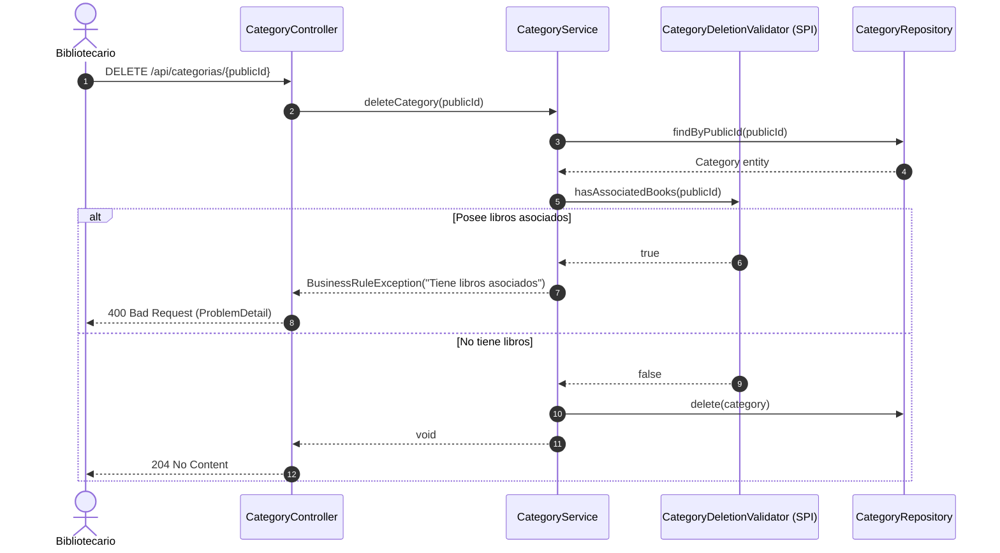
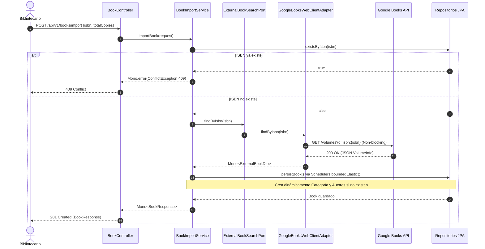
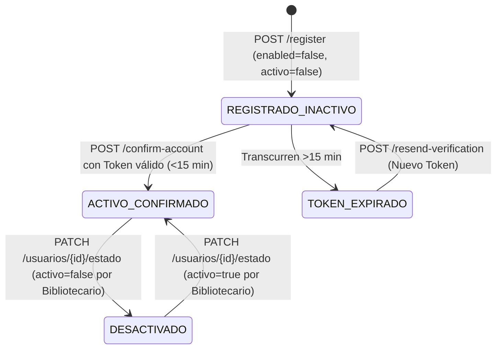
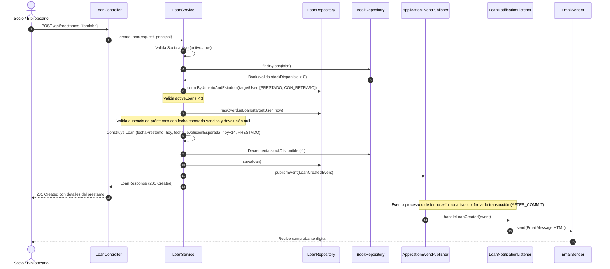
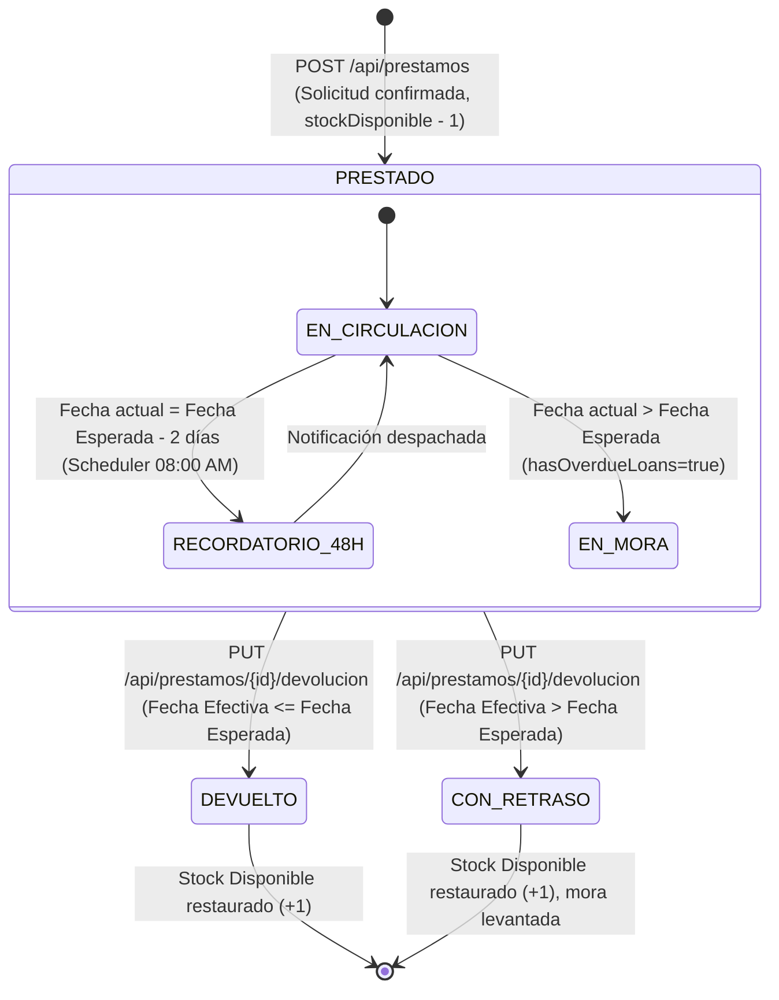
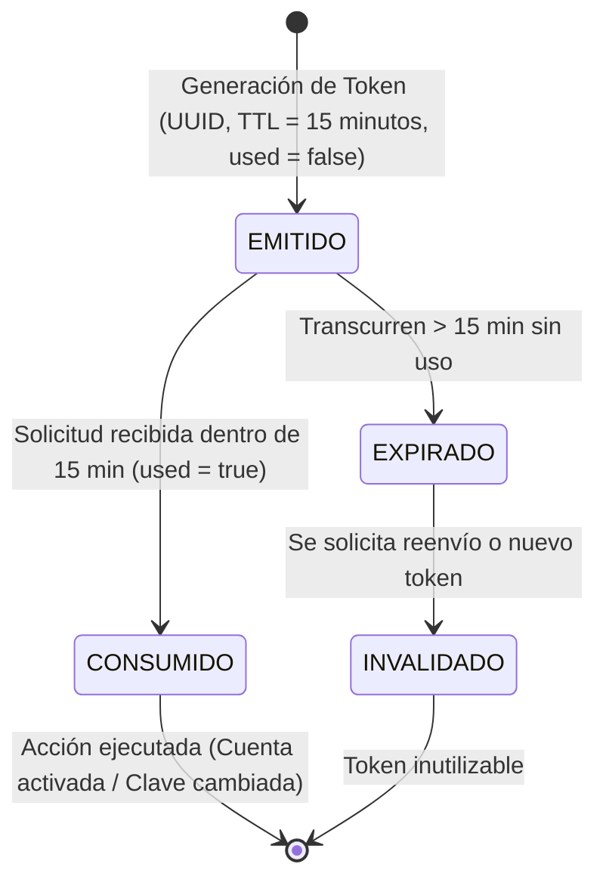

# Guía de Implementación y Arquitectura del Sistema (Implementation Guide)

> **Destinatarios:** Estudiantes, desarrolladores y colaboradores que deseen comprender la arquitectura interna, los patrones de diseño aplicados, las decisiones técnicas y la implementación detallada de cada una de las funcionalidades del Sistema de Gestión de Biblioteca.

---

## 1. Introducción y Visión Arquitectónica

El **Sistema de Gestión de Biblioteca** está desarrollado sobre el framework **Spring Boot 4** y **Java 21**, estructurado bajo una combinación de dos estilos arquitectónicos complementarios:
1. **Package-by-Feature (Vertical Slicing):** En los módulos de negocio internos (`com.EduardoMango.Biblioteca.feature.*`), el código está organizado por dominio funcional (autores, libros, categorías, préstamos, usuarios, autenticación) en lugar de capas técnicas horizontales dispersas. Esto maximiza la alta cohesión y minimiza el acoplamiento entre módulos.
2. **Arquitectura Hexagonal (Puertos y Adaptadores):** En los puntos de contacto con servicios externos y componentes de infraestructura (`domain.*` e `infrastructure.*`), se aplica inversión de dependencias estricta: el dominio declara interfaces (**Puertos**) y la infraestructura provee implementaciones intercambiables (**Adaptadores**).

```text
com.EduardoMango.Biblioteca
├── config/                  # Configuración global de la aplicación (Beans, Async, Scheduling)
├── security/                # Seguridad declarativa, filtros JWT, handlers de autenticación
├── exception/               # Manejo centralizado de excepciones con RFC 7807 (ProblemDetail)
│
├── feature/                 # Módulos organizados por Feature (Package-by-Feature)
│   ├── author/              # ABM y búsqueda de Autores
│   ├── book/                # Catálogo de libros, stock y DTOs de integración
│   ├── category/            # ABM de Categorías
│   ├── loan/                # Lógica Core de Préstamos, Devoluciones y Recordatorios
│   ├── user/                # Administración de usuarios y perfil personal
│   └── auth/                # Registro, login, refresh token, confirmación y recuperación
│
├── domain/                  # Núcleo de dominio desacoplado de infraestructura externa
│   └── book/                # Puertos de salida y servicios reactivos de sincronización
│
└── infrastructure/          # Adaptadores tecnológicos de salida
    ├── email/               # Adaptador JavaMailSender y puerto EmailSender
    └── googlebooks/         # Adaptador WebClient para la API externa de Google Books
```

---

## 2. Mapa de Patrones de Diseño y Principios de Ingeniería

| Patrón / Principio | Dónde se aplica en el proyecto | Clases e Interfaces representativas | Propósito y Beneficio Didáctico |
| :--- | :--- | :--- | :--- |
| **Hexagonal / Ports & Adapters** | Integración externa con Google Books y servicio de correos electrónicos. | [`ExternalBookSearchPort`](src/main/java/com/EduardoMango/Biblioteca/domain/book/port/out/ExternalBookSearchPort.java) $\to$ [`GoogleBooksWebClientAdapter`](src/main/java/com/EduardoMango/Biblioteca/infrastructure/googlebooks/adapter/out/GoogleBooksWebClientAdapter.java); [`EmailSender`](src/main/java/com/EduardoMango/Biblioteca/infrastructure/email/port/out/EmailSender.java) $\to$ [`JavaMailSenderAdapter`](src/main/java/com/EduardoMango/Biblioteca/infrastructure/email/adapter/out/JavaMailSenderAdapter.java). | Aísla la lógica de negocio de los detalles tecnológicos (HTTP, SMTP). Permite cambiar de proveedor o crear mocks en pruebas sin tocar el dominio. |
| **Dependency Inversion (SPI / Validator)** | Reglas de borrado de taxonomías con libros asociados sin acoplar paquetes. | [`CategoryDeletionValidator`](src/main/java/com/EduardoMango/Biblioteca/feature/category/service/CategoryDeletionValidator.java) $\to$ [`BookCategoryDeletionValidator`](src/main/java/com/EduardoMango/Biblioteca/feature/book/service/BookCategoryDeletionValidator.java); [`AuthorDeletionValidator`](src/main/java/com/EduardoMango/Biblioteca/feature/author/service/AuthorDeletionValidator.java) $\to$ [`BookAuthorDeletionValidator`](src/main/java/com/EduardoMango/Biblioteca/feature/book/service/BookAuthorDeletionValidator.java). | `CategoryService` y `AuthorService` no dependen de `BookRepository`. Invierten la dependencia mediante una interfaz que el módulo `book` implementa. |
| **Observer / Domain Events** | Disparo de correos tras confirmar registros o préstamos en base de datos. | [`UserRegisteredEvent`](src/main/java/com/EduardoMango/Biblioteca/feature/user/event/UserRegisteredEvent.java) $\to$ [`AccountVerificationListener`](src/main/java/com/EduardoMango/Biblioteca/feature/auth/listener/AccountVerificationListener.java); [`LoanCreatedEvent`](src/main/java/com/EduardoMango/Biblioteca/feature/loan/event/LoanCreatedEvent.java) $\to$ [`LoanNotificationListener`](src/main/java/com/EduardoMango/Biblioteca/feature/loan/listener/LoanNotificationListener.java). | Garantiza el principio de responsabilidad única. Desacopla la transacción de negocio del envío de notificaciones por email. |
| **Transactional Outbox / AFTER_COMMIT** | En listeners de eventos de dominio (`@TransactionalEventListener`). | `AccountVerificationListener`, `LoanNotificationListener`. | Evita "notificaciones fantasma": el correo electrónico **solo** se despacha si la transacción en base de datos concluyó con éxito (`AFTER_COMMIT`). |
| **Specification Pattern** | Búsquedas dinámicas y multicriterio sobre el catálogo y supervisión de préstamos. | [`BookSpecification.java`](src/main/java/com/EduardoMango/Biblioteca/feature/book/repository/BookSpecification.java), [`LoanSpecification.java`](src/main/java/com/EduardoMango/Biblioteca/feature/loan/repository/LoanSpecification.java). | Construye predicados JPA Criteria combinables en memoria sin concatenar cadenas SQL ni escribir decenas de métodos `@Query`. |
| **Data Transfer Object (DTO) con Records** | Entrada y salida de todos los controladores REST. | `BookCreateRequest`, `CategoryResponse`, `LoanResponse`, `AuthRequest`, etc. | Aprovecha los **Java Records** para garantizar inmutabilidad, concisión y serialización limpia, aplicando validaciones de Bean Validation (`@Valid`). |
| **Data Mapper** | Transformación bidireccional entre Entidades JPA y DTOs. | [`CategoryMapper`](src/main/java/com/EduardoMango/Biblioteca/feature/category/CategoryMapper.java), [`AuthorMapper`](src/main/java/com/EduardoMango/Biblioteca/feature/author/AuthorMapper.java), [`BookMapper`](src/main/java/com/EduardoMango/Biblioteca/feature/book/BookMapper.java), [`LoanMapper`](src/main/java/com/EduardoMango/Biblioteca/feature/loan/LoanMapper.java). | Generación en tiempo de compilación con **MapStruct**, eliminando código repetitivo de mapeo manual y previniendo errores de asignación. |
| **Scheduled Task (Cron Pattern)** | Ejecución desatendida diaria para alertar préstamos por vencer. | [`LoanReminderScheduler.java`](src/main/java/com/EduardoMango/Biblioteca/feature/loan/scheduler/LoanReminderScheduler.java). | Ejecución periódica automática mediante expresión Cron configurada en propiedades de entorno (`@Scheduled`). |
| **Anti-Enumeration Pattern** | Solicitud de restablecimiento de contraseña. | [`AuthService.processForgotPassword`](src/main/java/com/EduardoMango/Biblioteca/feature/auth/AuthService.java). | Previene que atacantes deduzcan si un correo existe o no en la plataforma retornando un mensaje de éxito genérico idéntico en ambos casos. |
| **Failsafe / Tolerancia a Fallos** | Manejo de excepciones en envío de correo. | [`JavaMailSenderAdapter.java`](src/main/java/com/EduardoMango/Biblioteca/infrastructure/email/adapter/out/JavaMailSenderAdapter.java). | Captura fallos de conectividad SMTP y los registra en log sin interrumpir ni hacer rollback a la transacción principal de la aplicación. |
| **Dual Route Mapping** | Soporte de rutas en español e inglés versionado. | `@RequestMapping({"/api/v1/books", "/api/libros"})` en [`BookController.java`](src/main/java/com/EduardoMango/Biblioteca/feature/book/BookController.java). | Garantiza compatibilidad retroactiva con clientes legados y apego a estándares REST modernos. |

---

## 3. Desglose de Implementación por Capacidad y Funcionalidad

---

### Capacidad 1: Gestión de Autores y Categorías

#### Funcionalidad 1.1: ABM de Categorías de Libros
* **Objetivo didáctico:** Explicar cómo exponer un CRUD REST seguro, aplicar paginación opcional con valores por defecto, y validar restricciones de integridad referencial hacia otros módulos sin generar acoplamiento directo.
* **Reglas de negocio aplicadas:** `BR-001` (Unicidad insensible a mayúsculas), `BR-002` (Nombre obligatorio), `BR-003` (Prohibición de borrado si existen libros vinculados).
* **Componentes arquitectónicos involucrados:**
  - Controlador: [`CategoryController.java`](src/main/java/com/EduardoMango/Biblioteca/feature/category/CategoryController.java)
  - Servicio: [`CategoryService.java`](src/main/java/com/EduardoMango/Biblioteca/feature/category/service/CategoryService.java)
  - Entidad: [`Category.java`](src/main/java/com/EduardoMango/Biblioteca/feature/category/Category.java)
  - Repositorio: [`CategoryRepository.java`](src/main/java/com/EduardoMango/Biblioteca/feature/category/CategoryRepository.java)
  - Validador SPI: [`CategoryDeletionValidator.java`](src/main/java/com/EduardoMango/Biblioteca/feature/category/service/CategoryDeletionValidator.java) implementado por [`BookCategoryDeletionValidator.java`](src/main/java/com/EduardoMango/Biblioteca/feature/book/service/BookCategoryDeletionValidator.java).
* **Diagrama de Secuencia:**



* **Puntos clave de código:**
  - **Identificador Público Inmutable:** En [`Category.java`](src/main/java/com/EduardoMango/Biblioteca/feature/category/Category.java), se genera un `UUID publicId` en el `@PrePersist` para evitar exponer la clave primaria secuencial de base de datos (`Long id`).
  - **Inversión de Dependencias:** `CategoryService` no inyecta `BookRepository`. Inyecta `CategoryDeletionValidator`. El módulo `book` provee la implementación `@Primary` `BookCategoryDeletionValidator`, cumpliendo el principio de inversión de dependencias (DIP).

---

#### Funcionalidad 1.2: ABM de Autores
* **Objetivo didáctico:** Mostrar el uso de consultas JPQL dinámicas y coalescentes para filtros opcionales de búsqueda parcial, junto con validación de borrado condicional idéntica a categorías.
* **Reglas de negocio aplicadas:** `BR-004` (Nombre y apellido obligatorios), `BR-005` (Inmutabilidad de publicId), `BR-006` (Restricción de borrado con libros asociados).
* **Componentes arquitectónicos involucrados:**
  - Controlador: [`AuthorController.java`](src/main/java/com/EduardoMango/Biblioteca/feature/author/AuthorController.java)
  - Servicio: [`AuthorService.java`](src/main/java/com/EduardoMango/Biblioteca/feature/author/service/AuthorService.java)
  - Repositorio: [`AuthorRepository.java`](src/main/java/com/EduardoMango/Biblioteca/feature/author/AuthorRepository.java)
  - Validador SPI: [`AuthorDeletionValidator.java`](src/main/java/com/EduardoMango/Biblioteca/feature/author/service/AuthorDeletionValidator.java) implementado por [`BookAuthorDeletionValidator.java`](src/main/java/com/EduardoMango/Biblioteca/feature/book/service/BookAuthorDeletionValidator.java).
* **Implementación de Búsqueda Flexible:** En [`AuthorRepository.java`](src/main/java/com/EduardoMango/Biblioteca/feature/author/AuthorRepository.java), se resuelve la búsqueda combinada mediante JPQL sin requerir un Specification builder complejo:
  ```java
  @Query("SELECT a FROM Author a WHERE " +
         "(:q IS NULL OR :q = '' OR LOWER(a.nombre) LIKE LOWER(CONCAT('%', :q, '%')) OR LOWER(a.apellido) LIKE LOWER(CONCAT('%', :q, '%'))) AND " +
         "(:nacionalidad IS NULL OR :nacionalidad = '' OR LOWER(a.nacionalidad) LIKE LOWER(CONCAT('%', :nacionalidad, '%')))")
  List<Author> searchAuthors(@Param("q") String q, @Param("nacionalidad") String nacionalidad);
  ```

---

### Capacidad 2: Gestión de Catálogo de Libros y Stock

#### Funcionalidad 2.1: Alta y Edición de Libros
* **Objetivo didáctico:** Explicar cómo mantener la consistencia entre stock total y disponible, cómo validar relaciones foráneas múltiples (Many-to-Many con Autores y Many-to-One con Categoría) y cómo preservar el inventario comprometido en operaciones de actualización.
* **Reglas de negocio aplicadas:** `BR-007` (Datos obligatorios de alta), `BR-008` (Unicidad de ISBN), `BR-009` (Inicialización de stock disponible = total), `BR-010` (Nuevo stock total no puede ser inferior a ejemplares prestados).
* **Componentes arquitectónicos involucrados:**
  - Controlador: [`BookController.java`](src/main/java/com/EduardoMango/Biblioteca/feature/book/BookController.java)
  - Servicio: [`BookService.java`](src/main/java/com/EduardoMango/Biblioteca/feature/book/service/BookService.java)
  - DTOs: [`BookCreateRequest.java`](src/main/java/com/EduardoMango/Biblioteca/feature/book/dto/BookCreateRequest.java), [`BookUpdateRequest.java`](src/main/java/com/EduardoMango/Biblioteca/feature/book/dto/BookUpdateRequest.java), [`BookResponse.java`](src/main/java/com/EduardoMango/Biblioteca/feature/book/dto/BookResponse.java)
  - Entidad: [`Book.java`](src/main/java/com/EduardoMango/Biblioteca/feature/book/Book.java)
* **Cálculo de Consistencia en Edición:**
  Al actualizar un libro en [`BookService.updateBook`](src/main/java/com/EduardoMango/Biblioteca/feature/book/service/BookService.java#L102-L108):
  $$\text{prestados} = \text{book.getStockTotal()} - \text{book.getStockDisponible()}$$
  Si $\text{request.stockTotal()} < \text{prestados}$, se lanza `BusinessRuleException`. De lo contrario:
  $$\text{nuevoDisponible} = \text{request.stockTotal()} - \text{prestados}$$

---

#### Funcionalidad 2.2: Búsqueda y Filtrado del Catálogo
* **Objetivo didáctico:** Demostrar la aplicación del **Specification Pattern** con JPA Criteria API para combinar dinámicamente filtros opcionales de búsqueda parcial, filtrado por UUID de categoría, unión (`Join`) por lista de autores y disponibilidad de stock.
* **Reglas de negocio aplicadas:** `BR-011` (Filtros combinables, acceso público autenticado, paginación por defecto ordenada por título asc).
* **Componentes arquitectónicos:**
  - Clase de especificación: [`BookSpecification.java`](src/main/java/com/EduardoMango/Biblioteca/feature/book/repository/BookSpecification.java)
  - Repositorio: [`BookRepository.java`](src/main/java/com/EduardoMango/Biblioteca/feature/book/repository/BookRepository.java) (extiende `JpaSpecificationExecutor<Book>`).
* **Implementación del Specification Pattern:**
  ```java
  public static Specification<Book> withFilters(String titulo, String isbn, UUID categoriaPublicId, UUID autorPublicId, Boolean soloDisponibles) {
      return (root, query, cb) -> {
          List<Predicate> predicates = new ArrayList<>();
          if (titulo != null && !titulo.isBlank()) {
              predicates.add(cb.like(cb.lower(root.get("titulo")), "%" + titulo.trim().toLowerCase() + "%"));
          }
          if (categoriaPublicId != null) {
              predicates.add(cb.equal(root.get("categoria").get("publicId"), categoriaPublicId));
          }
          if (autorPublicId != null) {
              Join<Book, Author> authorJoin = root.join("autores");
              predicates.add(cb.equal(authorJoin.get("publicId"), autorPublicId));
          }
          if (Boolean.TRUE.equals(soloDisponibles)) {
              predicates.add(cb.greaterThan(root.get("stockDisponible"), 0));
          }
          return cb.and(predicates.toArray(new Predicate[0]));
      };
  }
  ```

---

#### Funcionalidad 2.3: Ajuste Manual de Stock
* **Objetivo didáctico:** Explicar cómo diseñar operaciones atómicas específicas de inventario físico mediante endpoints específicos (`PATCH /api/libros/{isbn}/stock`), diferenciándolas de la actualización general de metadatos.
* **Reglas de negocio aplicadas:** `BR-010` y `BR-012` (Ajuste atómico restringido a Bibliotecario; nuevo stock total $\ge$ copias prestadas).
* **Componente y Método:** [`BookService.adjustStock`](src/main/java/com/EduardoMango/Biblioteca/feature/book/service/BookService.java#L147-L162).

---

### Capacidad 3: Integración Externa y Curaduría (Google Books)

#### Funcionalidad 3.1: Importación Directa desde Google Books
* **Objetivo didáctico:** Integrar servicios externos HTTP mediante programación reactiva no bloqueante con **Spring WebFlux WebClient**, gestionar respuestas asíncronas (`Mono`) y manejar transacciones JPA bloqueantes mediante puentes reactivos (`Schedulers.boundedElastic()`).
* **Reglas de negocio aplicadas:** `BR-008` (Unicidad ISBN), `BR-013` (Prevención de duplicados locales), `BR-014` (Alta dinámica de taxonomías inexistentes).
* **Componentes arquitectónicos:**
  - Puerto de salida: [`ExternalBookSearchPort.java`](src/main/java/com/EduardoMango/Biblioteca/domain/book/port/out/ExternalBookSearchPort.java)
  - Adaptador WebClient: [`GoogleBooksWebClientAdapter.java`](src/main/java/com/EduardoMango/Biblioteca/infrastructure/googlebooks/adapter/out/GoogleBooksWebClientAdapter.java)
  - Servicio de importación: [`BookImportService.java`](src/main/java/com/EduardoMango/Biblioteca/feature/book/service/BookImportService.java)
* **Diagrama de Secuencia de Importación Reactiva:**



---

#### Funcionalidad 3.2: Previsualización y Curaduría de Borradores (Pre-fill)
* **Objetivo didáctico:** Permitir la interacción asistida con el usuario donde el backend actúa como agregador de información sin persistir el registro, informando al cliente si ya existe un ejemplar previo mediante banderas informativas (`alreadyExistsInLocalCatalog`).
* **Reglas de negocio aplicadas:** `BR-017` (Borrador no persistido con flag de existencia previa).
* **Componentes:** [`BookImportService.previewExternalBook`](src/main/java/com/EduardoMango/Biblioteca/feature/book/service/BookImportService.java#L54-L77), DTO [`ExternalBookPreviewDto.java`](src/main/java/com/EduardoMango/Biblioteca/feature/book/dto/ExternalBookPreviewDto.java).

---

#### Funcionalidad 3.3: Sincronización y Enriquecimiento de Metadatos
* **Objetivo didáctico:** Implementar estrategias de actualización no destructivas (*non-destructive updates*) preservando el estado crítico de negocio (stock físico, identificadores e historial de préstamos).
* **Reglas de negocio aplicadas:** `BR-015` (Actualización selectiva de campos nulos salvo `force = true`), `BR-016` (Inviolabilidad de copias e historial).
* **Componentes:** [`BookSyncService.java`](src/main/java/com/EduardoMango/Biblioteca/domain/book/service/BookSyncService.java), [`BookSyncController.java`](src/main/java/com/EduardoMango/Biblioteca/domain/book/adapter/in/web/BookSyncController.java).
* **Mecanismo No Destructivo:**
  ```java
  if (force || book.getDescripcion() == null || book.getDescripcion().isBlank()) {
      if (dto.description() != null && !dto.description().isBlank()) {
          book.setDescripcion(dto.description().trim());
      }
  }
  // stockTotal y stockDisponible NUNCA son tocados en la sincronización
  ```

---

### Capacidad 4: Gestión de Usuarios, Autenticación y Cuentas

#### Funcionalidad 4.1: Registro y Confirmación de Cuenta por Email
* **Objetivo didáctico:** Explicar el ciclo de vida de una cuenta de usuario desde su creación inactiva hasta su activación mediante token temporal con vencimiento estricto (15 min), utilizando eventos de dominio para no bloquear el hilo de ejecución principal.
* **Reglas de negocio aplicadas:** `BR-018` (Estado inactivo por defecto `enabled = false`), `BR-019` (Token TTL 15 minutos de un solo uso), `BR-021` (Contraseña cifrada con BCrypt).
* **Componentes arquitectónicos:**
  - Controlador: [`AuthController.java`](src/main/java/com/EduardoMango/Biblioteca/feature/auth/AuthController.java)
  - Servicio de Cuentas: [`AccountVerificationService.java`](src/main/java/com/EduardoMango/Biblioteca/feature/auth/service/AccountVerificationService.java)
  - Listener Asíncrono: [`AccountVerificationListener.java`](src/main/java/com/EduardoMango/Biblioteca/feature/auth/listener/AccountVerificationListener.java)
  - Entidades: [`UserEntity.java`](src/main/java/com/EduardoMango/Biblioteca/feature/user/UserEntity.java), [`CredentialsEntity.java`](src/main/java/com/EduardoMango/Biblioteca/feature/auth/domain/CredentialsEntity.java), [`AccountVerificationToken.java`](src/main/java/com/EduardoMango/Biblioteca/feature/auth/domain/AccountVerificationToken.java).
* **Diagrama de Estado del Usuario:**



---

#### Funcionalidad 4.2: Restablecimiento de Contraseña
* **Objetivo didáctico:** Implementar mitigaciones contra ataques de enumeración de usuarios (retornando siempre HTTP 200 con mensaje genérico) y garantizar la invalidación de tokens previos tras el cambio de clave.
* **Reglas de negocio aplicadas:** `BR-019` (Token temporal 15 min de uso único), `BR-020` (Protección anti-enumeración), `BR-021` (BCrypt e invalidación de tokens activos).
* **Componentes:** [`AuthService.processForgotPassword`](src/main/java/com/EduardoMango/Biblioteca/feature/auth/AuthService.java#L93-L127), [`AuthService.resetPassword`](src/main/java/com/EduardoMango/Biblioteca/feature/auth/AuthService.java#L129-L163).

---

#### Funcionalidad 4.3: Consulta de Perfil e Historial Personal
* **Objetivo didáctico:** Implementar el principio de auto-consulta (*self-only*) leyendo la identidad directamente del `SecurityContextHolder` (a través de la inyección de `Authentication` en el controlador), evitando el riesgo de exposición de datos de terceros.
* **Reglas de negocio aplicadas:** `BR-024` (Acceso exclusivo a perfil propio e historial ordenado descendentemente por fecha de emisión).
* **Componentes:** [`UserProfileController.java`](src/main/java/com/EduardoMango/Biblioteca/feature/user/controller/UserProfileController.java), [`UserProfileService.java`](src/main/java/com/EduardoMango/Biblioteca/feature/user/service/UserProfileService.java).

---

#### Funcionalidad 4.4: Administración de Usuarios y Roles
* **Objetivo didáctico:** Asegurar endpoints administrativos con `@PreAuthorize("hasRole('BIBLIOTECARIO')")`, aplicar reglas de autoprotección institucional (impedir que el propio administrador se bloquee o rebaje su rol) y verificar la ausencia de dependencias activas (libros en posesión) antes de suspender una cuenta.
* **Reglas de negocio aplicadas:** `BR-022` (Autoprotección de cuenta administradora), `BR-023` (Bloqueo de baja si posee préstamos activos o retrasados).
* **Componente y Lógica:** En [`UserAdminService.updateUserStatus`](src/main/java/com/EduardoMango/Biblioteca/feature/user/service/UserAdminService.java#L43-L61):
  ```java
  if (targetUser.getPublicId().equals(authenticatedUser.getPublicId()) && Boolean.FALSE.equals(activo)) {
      throw new BusinessRuleException("Operación no permitida: Un usuario no puede desactivar su propia cuenta");
  }
  if (Boolean.FALSE.equals(activo)) {
      boolean hasPendingLoans = loanRepository.existsByUsuarioAndEstadoIn(
              targetUser, List.of(LoanStatus.PRESTADO, LoanStatus.CON_RETRASO));
      if (hasPendingLoans) {
          throw new BusinessRuleException("No se puede desactivar un usuario con préstamos pendientes de devolución");
      }
  }
  ```

---

### Capacidad 5: Gestión de Préstamos y Devoluciones (Lógica Core)

#### Funcionalidad 5.1: Solicitud y Registro de Préstamos
* **Objetivo didáctico:** Mostrar la orquestación de múltiples reglas de validación transaccionales, impacto atómico sobre el inventario y publicación de eventos de dominio post-commit.
* **Reglas de negocio aplicadas:** `BR-025` (Socio activo), `BR-026` (Stock disponible > 0), `BR-027` (Máximo 3 préstamos activos), `BR-028` (Cero tolerancia a morosidad previa), `BR-029` (Plazo fijo de 14 días corridos), `BR-030` (Decremento atómico de stock disponible en 1), `BR-035` (Comprobante digital por correo).
* **Componentes arquitectónicos:**
  - Controlador: [`LoanController.java`](src/main/java/com/EduardoMango/Biblioteca/feature/loan/LoanController.java)
  - Servicio: [`LoanService.java`](src/main/java/com/EduardoMango/Biblioteca/feature/loan/LoanService.java)
  - Evento de Dominio: [`LoanCreatedEvent.java`](src/main/java/com/EduardoMango/Biblioteca/feature/loan/event/LoanCreatedEvent.java)
  - Listener: [`LoanNotificationListener.java`](src/main/java/com/EduardoMango/Biblioteca/feature/loan/listener/LoanNotificationListener.java)
* **Diagrama de Secuencia:**



---

#### Funcionalidad 5.2: Registro de Devolución e Inspección de Plazos
* **Objetivo didáctico:** Explicar cómo asentar el cierre de un ciclo de préstamo calculando el estado final en base a fechas, asegurando la restitución atómica de ejemplares y bloqueando dobles devoluciones.
* **Reglas de negocio aplicadas:** `BR-030` (Incremento atómico de stock disponible en 1), `BR-031` (Rol Bibliotecario exclusivo), `BR-032` (Transición a `DEVUELTO` si en fecha, `CON_RETRASO` si tardío), `BR-033` (Idempotencia: préstamo debe estar en estado `PRESTADO`).
* **Componente y Lógica:** En [`LoanService.returnLoan`](src/main/java/com/EduardoMango/Biblioteca/feature/loan/LoanService.java#L111-L134):
  ```java
  if (loan.getEstado() != LoanStatus.PRESTADO) {
      throw new BusinessRuleException("El préstamo indicado ya ha sido devuelto anteriormente");
  }
  LocalDate today = LocalDate.now();
  loan.setFechaDevolucionEfectiva(today);

  if (today.isAfter(loan.getFechaDevolucionEsperada())) {
      loan.setEstado(LoanStatus.CON_RETRASO);
  } else {
      loan.setEstado(LoanStatus.DEVUELTO);
  }

  Book book = loan.getLibro();
  book.setStockDisponible(book.getStockDisponible() + 1);
  bookRepository.save(book);
  ```

---

#### Funcionalidad 5.3: Supervisión y Monitoreo de Préstamos
* **Objetivo didáctico:** Mostrar la combinación de permisos restrictivos con filtros dinámicos de consulta mediante Specifications y paginación con ordenamiento temporal.
* **Reglas de negocio aplicadas:** `BR-031` (Privilegio exclusivo para Bibliotecarios; `403 Forbidden` para socios).
* **Componentes:** [`LoanController.getLoansForSupervision`](src/main/java/com/EduardoMango/Biblioteca/feature/loan/LoanController.java#L44-L53), [`LoanSpecification.java`](src/main/java/com/EduardoMango/Biblioteca/feature/loan/repository/LoanSpecification.java).

---

### Capacidad 6: Comunicaciones y Notificaciones Automatizadas

#### Funcionalidad 6.1: Despacho Asíncrono de Correos Electrónicos
* **Objetivo didáctico:** Implementar infraestructura de comunicaciones desacoplada, no bloqueante (`@Async`) y con política *failsafe* (tolerancia a fallos para que una indisponibilidad de red SMTP no revierta transacciones de negocio).
* **Reglas de negocio aplicadas:** `BR-034` (Ejecución asíncrona y tolerancia a fallos).
* **Componentes:** [`EmailSender.java`](src/main/java/com/EduardoMango/Biblioteca/infrastructure/email/port/out/EmailSender.java) (puerto), [`JavaMailSenderAdapter.java`](src/main/java/com/EduardoMango/Biblioteca/infrastructure/email/adapter/out/JavaMailSenderAdapter.java) (adaptador).

---

#### Funcionalidad 6.2: Notificación Instantánea de Alta de Préstamo
* **Objetivo didáctico:** Uso de plantillas HTML y desacoplamiento transaccional mediante `@TransactionalEventListener(phase = TransactionPhase.AFTER_COMMIT)`.
* **Reglas de negocio aplicadas:** `BR-029` y `BR-035` (Comprobante digital con fecha límite enviado post-commit).
* **Componente:** [`LoanNotificationListener.java`](src/main/java/com/EduardoMango/Biblioteca/feature/loan/listener/LoanNotificationListener.java).

---

#### Funcionalidad 6.3: Tarea Programada de Recordatorio de Devolución (48hs)
* **Objetivo didáctico:** Explicar cómo implementar procesamiento por lotes desatendido (*Batch / Scheduler*) utilizando `@Scheduled`, expresiones Cron, procesamiento por registro con tolerancia individual a fallas e idempotencia.
* **Reglas de negocio aplicadas:** `BR-034` y `BR-036` (Barrido diario automático que notifica préstamos con vencimiento exacto en 48 horas).
* **Componente:** [`LoanReminderScheduler.java`](src/main/java/com/EduardoMango/Biblioteca/feature/loan/scheduler/LoanReminderScheduler.java).
* **Implementación:**
  ```java
  @Scheduled(cron = "${app.scheduler.loan-reminder.cron:0 0 8 * * *}")
  @Transactional(readOnly = true)
  public void sendDueSoonLoanReminders() {
      LocalDate targetDate = LocalDate.now().plusDays(2);
      List<Loan> dueLoans = loanRepository.findActiveLoansDueAt(LoanStatus.PRESTADO, targetDate);

      for (Loan loan : dueLoans) {
          try {
              sendReminderEmail(loan);
          } catch (Exception e) {
              log.error("Error processing reminder for loan ID {}: {}", loan.getPublicId(), e.getMessage(), e);
          }
      }
  }
  ```

---

## 4. Diagramas de Estado Globales del Sistema

### 4.1. Máquina de Estados del Préstamo (`LoanStatus`)



---

### 4.2. Ciclo de Vida de los Tokens de Seguridad



---

## 5. Decisiones Técnicas y Transaccionalidad (Guía para Estudiantes)

### 1. ¿Por qué `@Transactional(readOnly = true)` a nivel de clase?
En servicios como `BookService` o `CategoryService`, anotar la clase con `@Transactional(readOnly = true)` optimiza el rendimiento de Hibernate/JPA: desactiva el mecanismo de comprobación de modificaciones en memoria (*dirty checking*) y optimiza la conexión con el motor relacional. Solo los métodos que modifican datos anotan `@Transactional` explícitamente.

### 2. ¿Cómo conviven WebFlux reactivo y JPA bloqueante?
En `BookImportService` y `BookSyncService`, las llamadas a Google Books son reactivas y no bloqueantes (`WebClient`). Sin embargo, JPA/Hibernate es bloqueante. Para no bloquear los hilos del Event Loop reactivo, la persistencia se delega al thread pool elástico mediante `.subscribeOn(Schedulers.boundedElastic())` y se orquesta con `TransactionTemplate.execute()`.

### 3. ¿Por qué se utilizó `UUID publicId` además de `Long id`?
Las claves primarias autoincrementales (`Long id`) son muy eficientes para índices relacionales y claves foráneas internas, pero exponen vulnerabilidades si se publican en la API REST (ataques de enumeración secuencial). Exponer `UUID publicId` hacia el cliente y reservar `Long id` para la base de datos resuelve ambos desafíos.

---

## 6. Guía de Testing y Extensibilidad

### Ejecución de Pruebas Automatizadas
El proyecto cuenta con una batería completa de pruebas unitarias y de integración:
```bash
# Ejecutar todas las pruebas unitarias y de integración
./mvnw clean test

# Ejecutar únicamente pruebas de integración de préstamos
./mvnw test -Dtest=LoanIntegrationTest

# Ejecutar pruebas de seguridad y autenticación
./mvnw test -Dtest=*Auth*
```

### ¿Cómo agregar una nueva regla de negocio respetando la arquitectura?
1. **Regla interna de un módulo:** Implementarla dentro del método correspondiente en el Service (ej. `LoanService`), arrojando `BusinessRuleException("Mensaje descriptivo")`. Automáticamente `GlobalExceptionHandler` la serializará en formato RFC 7807 con código HTTP 400.
2. **Regla que involucra dos módulos sin acoplarlos:**
   - Crear una interfaz SPI en el módulo que necesita la validación (ej. `feature.category.service.CategoryDeletionValidator`).
   - Implementar el validador en el módulo que posee los datos (ej. `feature.book.service.BookCategoryDeletionValidator`).
   - Marcar la implementación con `@Component` y `@Primary`.

