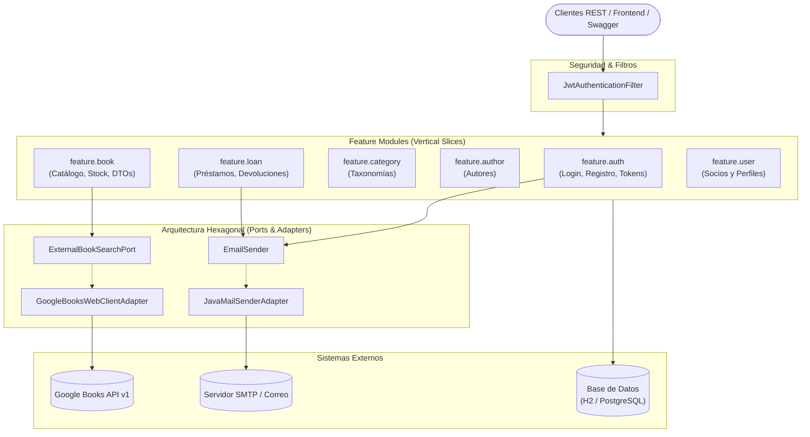

# Sistema de Gestión de Biblioteca (Library Management System)

[](https://openjdk.org/)
[](https://spring.io/projects/spring-boot)
[-6DB33F?logo=springsecurity&logoColor=white)](https://spring.io/projects/spring-security)
[](https://www.postgresql.org/)
[](LICENSE)
[-brightgreen)](#-pruebas-y-calidad)
[](#-arquitectura-del-sistema)

Backend RESTful robusto, escalable y seguro para la administración integral de bibliotecas institucionales, gestión de inventario bibliográfico, control de préstamos en tiempo real con mitigación de mora y enriquecimiento automatizado de metadatos vía Google Books API.

---

## Problemática y Razón de Ser

La administración tradicional de bibliotecas suele enfrentar cuellos de botella operativos que afectan tanto a los bibliotecarios como a los lectores:

* **Pérdida de inventario y falta de sincronización:** Desfasaje entre ejemplares físicos disponibles y registros del catálogo ante préstamos simultáneos.
* **Carga manual repetitiva de datos:** La catalogación manual de títulos, ISBNs, autores y sinopsis insume tiempo excesivo y es propensa a inconsistencias.
* **Falta de trazabilidad y mora:** Dificultad para supervisar devoluciones vencidas, alertar proactivamente a los socios y aplicar políticas de penalización justas e inmediatas.
* **Seguridad y privacidad deficiente:** Exposición de claves primarias secuenciales internas, riesgos de enumeración de cuentas y falta de control de acceso por roles (*RBAC*).

### La Solución
Este sistema resuelve estas problemáticas mediante:
1. **Gobernanza estricta de inventario:** Control transaccional atómico de stock (`stockTotal` vs `stockDisponible`) que impide sobre-préstamos.
2. **Catalogación asistida y reactiva:** Integración con Google Books API mediante WebFlux y WebClient para previsualizar y sincronizar metadatos sin bloquear el hilo de ejecución.
3. **Flujo de préstamos con recordatorios automatizados:** Tareas programadas (*Schedulers*) que alertan por correo electrónico con 48 hs de antelación y restringen automáticamente nuevas solicitudes ante mora activa.
4. **Seguridad empresarial:** Autenticación basada en JWT (Access + Refresh tokens con rotación), activación de cuentas por token temporal, mitigación de ataques de enumeración y doble identificador (`Long id` interno para base de datos y `UUID publicId` hacia la API).

---

## Arquitectura del Sistema

El proyecto sigue un enfoque híbrido moderno que maximiza la cohesión y minimiza el acoplamiento:

* **Package-by-Feature (Vertical Slicing):** El negocio principal reside en `com.EduardoMango.Biblioteca.feature.*`, agrupado por dominios funcionales (autores, libros, categorías, préstamos, usuarios, autenticación).
* **Arquitectura Hexagonal (Ports & Adapters):** Las dependencias hacia servicios externos y terceros (Google Books, JavaMailSender) se gestionan mediante puertos en `domain.*` y adaptadores intercambiables en `infrastructure.*`.
* **Inversión de Dependencias (SPI):** Para evitar acoplamiento directo entre módulos (ej: verificar que una categoría o autor no posea libros antes de borrarse), se utilizan validadores desacoplados mediante interfaces SPI (`CategoryDeletionValidator`, `AuthorDeletionValidator`).



---

## Stack Tecnológico

| Componente | Tecnología | Versión / Detalle |
| :--- | :--- | :--- |
| **Lenguaje** | Java | 21 (LTS) |
| **Framework Base** | Spring Boot | 3.4+ / 4.x |
| **Persistencia** | Spring Data JPA / Hibernate | ORM relacional con Specifications y Criteria API |
| **Bases de Datos** | H2 Database / PostgreSQL | H2 en memoria para desarrollo/test; PostgreSQL para producción |
| **Seguridad** | Spring Security 6 + JJWT | 0.12.6 (Tokens HMAC-SHA256, BCrypt, RBAC) |
| **Cliente Reactivo** | Spring WebFlux (`WebClient`) | Consumo reactivo y no bloqueante de APIs externas |
| **Mapeo de Objetos** | MapStruct + Java Records | Mapeadores compilados tipo-seguros y DTOs inmutables |
| **Notificaciones** | Spring Boot Mail / JavaMail | Mensajería asíncrona HTML vía SMTP |
| **Documentación** | SpringDoc OpenAPI 3 | Swagger UI interactivo generado automáticamente |
| **Testing** | JUnit 5, Mockito, AssertJ | Pruebas unitarias, de integración y WebMvcTest |

---

## Puesta en Marcha Rápida (Quick Start)

### Prerrequisitos
* **Java JDK 21** o superior instalado ([OpenJDK](https://adoptium.net/)).
* **Git** instalado en el sistema.
* Puerto **8081** libre (configurable).

### 1. Clonar el Repositorio
```bash
git clone https://github.com/EduardoMango/Biblioteca.git
cd Biblioteca
```

### 2. Configurar Variables de Entorno
Copia el archivo de variables de entorno de ejemplo:
```bash
cp .env.example .env
```
*(Opcional)* Edita `.env` para ajustar tus credenciales de correo SMTP, base de datos PostgreSQL o clave de Google Books API. Por defecto, el sistema arranca con base de datos **H2 en memoria** lista para usar sin instalaciones adicionales.

### 3. Compilar y Ejecutar Pruebas
El proyecto utiliza el Maven Wrapper (`mvnw`), por lo que no requieres tener Maven instalado globalmente:
```bash
./mvnw clean test
```

### 4. Iniciar la Aplicación
```bash
./mvnw spring-boot:run
```
La aplicación iniciará en `http://localhost:8081`.

---

## Documentación de la API y Consola de Desarrollo

Una vez en ejecución, los siguientes servicios interactivos están disponibles:

| Recurso | URL | Descripción |
| :--- | :--- | :--- |
| **Swagger UI** | [http://localhost:8081/swagger-ui.html](http://localhost:8081/swagger-ui.html) | Interfaz visual interactiva para explorar y ejecutar todos los endpoints REST. |
| **OpenAPI Spec (JSON)** | [http://localhost:8081/v3/api-docs](http://localhost:8081/v3/api-docs) | Definición estándar OpenAPI 3.0 para importar en Postman o Insomnia. |
| **Consola H2** | [http://localhost:8081/h2-console](http://localhost:8081/h2-console) | Interfaz gráfica web para consultar la base de datos en memoria en tiempo de desarrollo. |

> **Credenciales H2 Console (por defecto):**
> * **JDBC URL:** `jdbc:h2:mem:bibliotecadb;DB_CLOSE_DELAY=-1;DB_CLOSE_ON_EXIT=FALSE`
> * **User Name:** `sa`
> * **Password:** *(dejar vacío)*

---

## Documentación Detallada del Proyecto

Para un análisis en profundidad del sistema, consulta los documentos de especificación técnica y funcional:

### Especificaciones de Alto Nivel (Raíz)
* **[`FEATURE-SET.md`](FEATURE-SET.md):**
  Especificación funcional consolidada del producto. Contiene el catálogo completo de capacidades, descripción de actores (`SOCIO`, `BIBLIOTECARIO`, `VISITANTE`), mapa de reglas de negocio (`BR-001` a `BR-036`), flujos de usuario y matriz de trazabilidad de los 18 features originales.

* **[`IMPLEMENTATION.md`](IMPLEMENTATION.md):**
  Guía didáctica y técnica de implementación. Desglosa los patrones de diseño aplicados (*Ports & Adapters, SPI Validator, Observer, Transactional Outbox, Specification, Scheduled Task, Anti-Enumeration*), diagramas de secuencia Mermaid, máquinas de estado de préstamos y tokens, y convivencia entre WebFlux reactivo y JPA transaccional.

### Guías Técnicas Especializadas (`docs/`)
* **[`docs/DATABASE_DATA_MODEL.md`](docs/DATABASE_DATA_MODEL.md):**
  Modelo de datos y diccionario de base de datos. Contiene el diagrama Entidad-Relación (ERD) en Mermaid, diccionario detallado con los tipos, restricciones y nulos de las 10 entidades y tablas intermedias, invariantes de negocio, patrones de ID dual (`Long id` vs `UUID publicId`) y script DDL compatible.

* **[`docs/SETUP_AND_TROUBLESHOOTING.md`](docs/SETUP_AND_TROUBLESHOOTING.md):**
  Guía de instalación, configuración del IDE (procesamiento de anotaciones para Lombok y MapStruct), parametrización de variables de entorno (`.env`, Mailtrap, Google Books) y matriz de resolución de problemas comunes (conflictos de puertos, errores de compilación, 401 en Swagger).

---

## Pruebas y Calidad

El proyecto implementa una sólida suite de pruebas unitarias y de integración que validan el 100% de los criterios de aceptación y flujos críticos de negocio:

```bash
# Ejecutar la suite completa de pruebas (155 tests)
./mvnw test

# Ejecutar únicamente pruebas de integración de préstamos
./mvnw test -Dtest=LoanIntegrationTest

# Ejecutar pruebas de importación externa con Google Books
./mvnw test -Dtest=BookImportIntegrationTest

# Ejecutar pruebas de autenticación y seguridad JWT
./mvnw test -Dtest=*Auth*
```

---

## Estructura del Código Fuente

```text
src/main/java/com/EduardoMango/Biblioteca
├── config/                  # Beans de infraestructura global (Jackson, WebClient, Async, Schedulers)
├── security/                # Seguridad Spring Security, filtros JWT y handlers de autenticación
├── exception/               # Manejo centralizado de excepciones RFC 7807 (ProblemDetail)
│
├── feature/                 # Módulos de negocio organizados por característica (Vertical Slicing)
│   ├── auth/                # Registro, login, refresh tokens, confirmación y recuperación
│   ├── author/              # ABM de autores y búsqueda flexible
│   ├── book/                # Catálogo de libros, stock físico y DTOs de integración
│   ├── category/            # Categorías y validación de borrado desacoplada (SPI)
│   ├── loan/                # Préstamos, devoluciones, supervisión y recordatorios automáticos
│   └── user/                # Administración de socios y consulta de perfil personal
│
├── domain/                  # Núcleo de dominio desacoplado
│   └── book/                # Puertos de salida y sincronización no destructiva de libros
│
└── infrastructure/          # Adaptadores tecnológicos de salida
    ├── email/               # Adaptador JavaMailSender y puerto EmailSender
    └── googlebooks/         # Adaptador WebClient para la API externa de Google Books
```

---

## Contribución y Buenas Prácticas

1. Toda nueva funcionalidad debe iniciar con sus respectivas pruebas unitarias y de integración (**TDD**).
2. Respetar el principio de responsabilidad única y no acoplar controladores con repositorios.
3. Exponer y utilizar exclusivamente `UUID publicId` en contratos de API REST; reservar `Long id` para claves primarias internas.
4. Anotar servicios con `@Transactional(readOnly = true)` a nivel de clase y sobreescribir `@Transactional` únicamente en métodos de mutación.

---

## Licencia

Este proyecto ha sido desarrollado con fines académicos, pedagógicos y de demostración de ingeniería de software moderna con Spring Boot y Java. Distribuido bajo la licencia [MIT](LICENSE).

