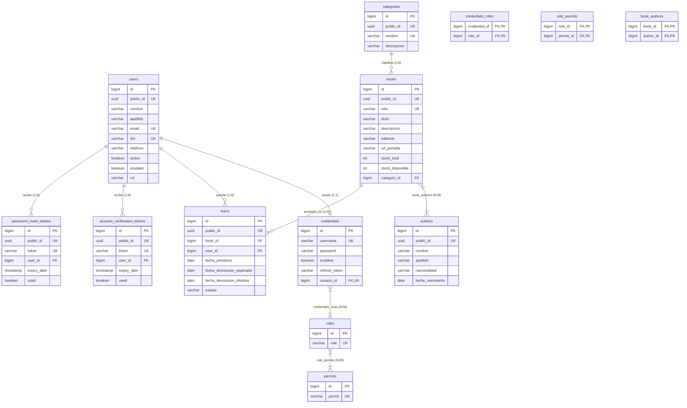

# Modelo de Datos y Diccionario de Base de Datos

Este documento define la arquitectura de persistencia, modelo relacional, entidades JPA, restricciones de integridad y ciclo de vida de los datos del sistema **Biblioteca API**.

---

## 1. Principios de Diseño de Persistencia

El modelo de datos fue diseñado siguiendo estándares modernos de arquitectura empresarial en Spring Boot y JPA / Hibernate:

1. **Patrón Dual-ID (Surrogate Internal ID vs. Public UUID):**
   - **ID Interno (`Long id` - `BIGINT IDENTITY`):** Clave primaria numérica secuencial para optimizar el rendimiento del motor de base de datos en índices de árbol B (B-Tree), uniones (`JOIN`) y almacenamiento de claves foráneas. **Nunca se expone en la API REST**.
   - **ID Público (`UUID publicId`):** Identificador universalmente único expuesto a clientes externos y endpoints HTTP. Previene ataques de enumeración e IDOR (*Insecure Direct Object References*). Se inicializa automáticamente en el hook `@PrePersist`.
2. **Estrategias de Carga (`FetchType`):**
   - **Dominio de Negocio (`LAZY`):** Todas las relaciones en libros, préstamos, categorías y usuarios utilizan carga diferida (`FetchType.LAZY`) para evitar el problema de consultas $N+1$ y sobrecarga de memoria.
   - **Subsistema de Seguridad (`EAGER`):** Las asociaciones `credentials -> roles -> permits` utilizan carga ansiosa controlada (`FetchType.EAGER`) requerida por Spring Security para poblar el contexto de autorización (`GrantedAuthority`) durante el ciclo de vida del token JWT.
3. **Casacada y Ciclo de Vida (`CascadeType`):**
   - `credentials` posee `CascadeType.ALL` sobre `UserEntity` para garantizar que la creación de una cuenta gestione de manera transaccional al usuario asociado.
   - Las relaciones Many-to-Many (`credentials_roles`, `role_permits`) emplean `CascadeType.PERSIST, CascadeType.MERGE` para evitar borrados accidentales de roles o permisos del catálogo maestro.
4. **Soft Delete vs. Estado Operacional:**
   - La tabla `users` implementa banderas booleanas `activo` y `enabled` para inhabilitación lógica y control de autenticación sin destrucción destructiva de historiales de préstamos.

---

## 2. Diagrama Entidad-Relación (Mermaid ERD)



---

## 3. Diccionario de Datos Exhaustivo

### 3.1. Módulo de Usuarios y Seguridad

#### Tabla: `users`
- **Entidad JPA:** `com.EduardoMango.Biblioteca.feature.user.UserEntity`
- **Descripción:** Registro central de socios y personal de la biblioteca.

| Columna | Tipo SQL | Nulo | Restricciones / Índices | Valor Defecto | Descripción |
| :--- | :--- | :---: | :--- | :---: | :--- |
| `id` | `BIGINT` | No | `PRIMARY KEY`, `AUTO_INCREMENT` | Serial | Clave subrogada interna de alta eficiencia. |
| `public_id` | `UUID` | No | `UNIQUE`, Inmutable (`updatable=false`) | `UUID.randomUUID()` | Identificador público expuesto en API REST. |
| `nombre` | `VARCHAR(255)` | No | - | - | Nombre(s) de pila del usuario. |
| `apellido` | `VARCHAR(255)` | No | - | - | Apellido(s) del usuario. |
| `email` | `VARCHAR(255)` | No | `UNIQUE` | - | Correo electrónico principal (usado para notificaciones y login). |
| `dni` | `VARCHAR(255)` | Sí | `UNIQUE` | `NULL` | Documento Nacional de Identidad del usuario. |
| `telefono` | `VARCHAR(255)` | Sí | - | `NULL` | Teléfono de contacto. |
| `activo` | `BOOLEAN` | No | - | `true` | Estado operativo / borrado lógico (un usuario inactivo no puede operar). |
| `enabled` | `BOOLEAN` | No | - | `true` | Estado de habilitación de la cuenta de usuario. |
| `rol` | `VARCHAR(255)` | No | - | `'SOCIO'` | Rol legible principal del usuario (`SOCIO` o `BIBLIOTECARIO`). |

---

#### Tabla: `credentials`
- **Entidad JPA:** `com.EduardoMango.Biblioteca.feature.auth.domain.CredentialsEntity`
- **Descripción:** Almacén de credenciales para autenticación en Spring Security (`UserDetails`).

| Columna | Tipo SQL | Nulo | Restricciones / Índices | Valor Defecto | Descripción |
| :--- | :--- | :---: | :--- | :---: | :--- |
| `id` | `BIGINT` | No | `PRIMARY KEY`, `AUTO_INCREMENT` | Serial | Clave subrogada interna. |
| `username` | `VARCHAR(255)` | No | `UNIQUE` | - | Nombre de usuario o identificador para inicio de sesión. |
| `password` | `VARCHAR(255)` | No | - | - | Hash BCrypt seguro de la contraseña. |
| `enabled` | `BOOLEAN` | No | - | `true` | Indicador si las credenciales están vigentes. |
| `refresh_token` | `VARCHAR(2048)` | Sí | - | `NULL` | Token de refresco JWT persistido para renovación de sesión. |
| `usuario_id` | `BIGINT` | Sí | `UNIQUE`, `FK -> users(id)` | `NULL` | Relación 1:1 con el perfil de usuario. `CascadeType.ALL`. |

---

#### Tabla: `roles`
- **Entidad JPA:** `com.EduardoMango.Biblioteca.feature.auth.domain.RoleEntity`
- **Descripción:** Catálogo maestro de roles del sistema RBAC.

| Columna | Tipo SQL | Nulo | Restricciones / Índices | Valor Defecto | Descripción |
| :--- | :--- | :---: | :--- | :---: | :--- |
| `id` | `BIGINT` | No | `PRIMARY KEY`, `AUTO_INCREMENT` | Serial | Clave primaria interna. |
| `role` | `VARCHAR(255)` | No | `UNIQUE`, Enum: `ROLE_SOCIO`, `ROLE_BIBLIOTECARIO` | - | Denominación del rol en formato Spring Security. |

---

#### Tabla: `permits`
- **Entidad JPA:** `com.EduardoMango.Biblioteca.feature.auth.domain.PermitEntity`
- **Descripción:** Catálogo de privilegios granulares asignables a los roles.

| Columna | Tipo SQL | Nulo | Restricciones / Índices | Valor Defecto | Descripción |
| :--- | :--- | :---: | :--- | :---: | :--- |
| `id` | `BIGINT` | No | `PRIMARY KEY`, `AUTO_INCREMENT` | Serial | Clave primaria interna. |
| `permit` | `VARCHAR(255)` | No | `UNIQUE`, Enum | - | Privilegio granular (`VER_LIBROS`, `SOLICITAR_PRESTAMO`, `GESTIONAR_LIBROS`, etc.). |

---

#### Tabla intermedia: `credentials_roles`
- **Mapeo:** `@JoinTable` en `CredentialsEntity.roles`
- **Descripción:** Relación Muchos a Muchos entre Credenciales y Roles.

| Columna | Tipo SQL | Nulo | Restricciones / Índices | Descripción |
| :--- | :--- | :---: | :--- | :--- |
| `credential_id` | `BIGINT` | No | `PK`, `FK -> credentials(id)` | Referencia a la credencial autenticada. |
| `role_id` | `BIGINT` | No | `PK`, `FK -> roles(id)` | Referencia al rol asignado. |

---

#### Tabla intermedia: `role_permits`
- **Mapeo:** `@JoinTable` en `RoleEntity.permits`
- **Descripción:** Relación Muchos a Muchos entre Roles y Permisos.

| Columna | Tipo SQL | Nulo | Restricciones / Índices | Descripción |
| :--- | :--- | :---: | :--- | :--- |
| `role_id` | `BIGINT` | No | `PK`, `FK -> roles(id)` | Referencia al rol poseedor. |
| `permit_id` | `BIGINT` | No | `PK`, `FK -> permits(id)` | Referencia al permiso otorgado. |

---

#### Tabla: `account_verification_tokens`
- **Entidad JPA:** `com.EduardoMango.Biblioteca.feature.auth.domain.AccountVerificationToken`
- **Descripción:** Tokens temporales para activación de cuenta vía correo electrónico.

| Columna | Tipo SQL | Nulo | Restricciones / Índices | Valor Defecto | Descripción |
| :--- | :--- | :---: | :--- | :---: | :--- |
| `id` | `BIGINT` | No | `PRIMARY KEY`, `AUTO_INCREMENT` | Serial | Clave primaria. |
| `public_id` | `UUID` | No | `UNIQUE`, Inmutable | `UUID.randomUUID()` | Identificador público. |
| `token` | `VARCHAR(255)` | No | `UNIQUE` | - | Token criptográfico o UUID de verificación enviado por email. |
| `user_id` | `BIGINT` | No | `FK -> users(id)` | - | Usuario propietario del token (`FetchType.LAZY`). |
| `expiry_date` | `TIMESTAMP` | No | - | - | Fecha y hora límite de validez. |
| `used` | `BOOLEAN` | No | - | `false` | Indica si el token ya fue consumido. |

---

#### Tabla: `password_reset_tokens`
- **Entidad JPA:** `com.EduardoMango.Biblioteca.feature.auth.domain.PasswordResetToken`
- **Descripción:** Tokens temporales para restablecimiento de contraseña olvidada.

| Columna | Tipo SQL | Nulo | Restricciones / Índices | Valor Defecto | Descripción |
| :--- | :--- | :---: | :--- | :---: | :--- |
| `id` | `BIGINT` | No | `PRIMARY KEY`, `AUTO_INCREMENT` | Serial | Clave primaria. |
| `public_id` | `UUID` | No | `UNIQUE`, Inmutable | `UUID.randomUUID()` | Identificador público. |
| `token` | `VARCHAR(255)` | No | `UNIQUE` | - | Token enviado en el enlace de recuperación. |
| `user_id` | `BIGINT` | No | `FK -> users(id)` | - | Usuario solicitante (`FetchType.LAZY`). |
| `expiry_date` | `TIMESTAMP` | No | - | - | Fecha de caducidad. |
| `used` | `BOOLEAN` | No | - | `false` | Marca de uso único. |

---

### 3.2. Módulo de Catálogo Bibliográfico

#### Tabla: `categories`
- **Entidad JPA:** `com.EduardoMango.Biblioteca.feature.category.Category`
- **Descripción:** Categorías o géneros temáticos de los libros.

| Columna | Tipo SQL | Nulo | Restricciones / Índices | Valor Defecto | Descripción |
| :--- | :--- | :---: | :--- | :---: | :--- |
| `id` | `BIGINT` | No | `PRIMARY KEY`, `AUTO_INCREMENT` | Serial | Clave primaria interna. |
| `public_id` | `UUID` | No | `UNIQUE`, Inmutable | `UUID.randomUUID()` | Identificador público para endpoints `/api/categories/{id}`. |
| `nombre` | `VARCHAR(255)` | No | `UNIQUE` | - | Nombre distintivo del género (ej. "Ciencia Ficción"). |
| `descripcion` | `VARCHAR(255)` | Sí | - | `NULL` | Descripción o alcance de la categoría. |

---

#### Tabla: `authors`
- **Entidad JPA:** `com.EduardoMango.Biblioteca.feature.author.Author`
- **Descripción:** Escritores y autores de las obras bibliográficas.

| Columna | Tipo SQL | Nulo | Restricciones / Índices | Valor Defecto | Descripción |
| :--- | :--- | :---: | :--- | :---: | :--- |
| `id` | `BIGINT` | No | `PRIMARY KEY`, `AUTO_INCREMENT` | Serial | Clave primaria interna. |
| `public_id` | `UUID` | No | `UNIQUE`, Inmutable | `UUID.randomUUID()` | Identificador público para endpoints `/api/autores/{id}`. |
| `nombre` | `VARCHAR(255)` | No | - | - | Nombre(s) del autor. |
| `apellido` | `VARCHAR(255)` | No | - | - | Apellido(s) del autor. |
| `nacionalidad` | `VARCHAR(255)` | Sí | - | `NULL` | País de origen o nacionalidad. |
| `fecha_nacimiento`| `DATE` | Sí | - | `NULL` | Fecha de natalicio. |

---

#### Tabla: `books`
- **Entidad JPA:** `com.EduardoMango.Biblioteca.feature.book.Book`
- **Descripción:** Catálogo maestro de libros disponibles en la biblioteca.

| Columna | Tipo SQL | Nulo | Restricciones / Índices | Valor Defecto | Descripción |
| :--- | :--- | :---: | :--- | :---: | :--- |
| `id` | `BIGINT` | No | `PRIMARY KEY`, `AUTO_INCREMENT` | Serial | Clave primaria interna. |
| `public_id` | `UUID` | No | `UNIQUE`, Inmutable | `UUID.randomUUID()` | Identificador público para endpoints `/api/libros/{id}`. |
| `isbn` | `VARCHAR(255)` | Sí | `UNIQUE` | `NULL` | Código normalizado internacional (ISBN-10 o ISBN-13). |
| `titulo` | `VARCHAR(255)` | No | - | - | Título principal de la obra. |
| `descripcion` | `VARCHAR(4000)`| Sí | - | `NULL` | Sinopsis o resumen extendido de la obra. |
| `editorial` | `VARCHAR(255)` | Sí | - | `NULL` | Casa editorial publicadora. |
| `url_portada` | `VARCHAR(1000)`| Sí | - | `NULL` | URL pública a la imagen de portada (Google Books o CDN). |
| `stock_total` | `INTEGER` | No | `stock_total >= 0` | - | Cantidad total de ejemplares físicos registrados. |
| `stock_disponible`| `INTEGER`| No | `0 <= stock_disponible <= stock_total` | `stock_total` | Ejemplares libres para nuevo préstamo en estantería. |
| `category_id` | `BIGINT` | No | `FK -> categories(id)` | - | Clasificación principal de la obra (`FetchType.LAZY`). |

---

#### Tabla intermedia: `book_authors`
- **Mapeo:** `@JoinTable` en `Book.autores`
- **Descripción:** Relación de co-autoría Muchos a Muchos entre libros y autores.

| Columna | Tipo SQL | Nulo | Restricciones / Índices | Descripción |
| :--- | :--- | :---: | :--- | :--- |
| `book_id` | `BIGINT` | No | `PK`, `FK -> books(id)` | Referencia al libro. |
| `author_id` | `BIGINT` | No | `PK`, `FK -> authors(id)` | Referencia al autor participante. |

---

### 3.3. Módulo Transaccional de Préstamos

#### Tabla: `loans`
- **Entidad JPA:** `com.EduardoMango.Biblioteca.feature.loan.domain.Loan`
- **Descripción:** Registro histórico y activo de préstamos y devoluciones.

| Columna | Tipo SQL | Nulo | Restricciones / Índices | Valor Defecto | Descripción |
| :--- | :--- | :---: | :--- | :---: | :--- |
| `id` | `BIGINT` | No | `PRIMARY KEY`, `AUTO_INCREMENT` | Serial | Clave primaria interna. |
| `public_id` | `UUID` | No | `UNIQUE`, Inmutable | `UUID.randomUUID()` | Identificador público para endpoints `/api/prestamos/{id}`. |
| `book_id` | `BIGINT` | No | `FK -> books(id)` | - | Ejemplar solicitado en préstamo (`FetchType.LAZY`). |
| `user_id` | `BIGINT` | No | `FK -> users(id)` | - | Socio prestatario (`FetchType.LAZY`). |
| `fecha_prestamo` | `DATE` | No | - | `LocalDate.now()` | Fecha de retiro del ejemplar. |
| `fecha_devolucion_esperada` | `DATE` | No | - | `fecha_prestamo + 14 días` | Fecha máxima pactada para retorno sin penalización. |
| `fecha_devolucion_efectiva` | `DATE` | Sí | - | `NULL` | Fecha real en la que el usuario entregó el libro. |
| `estado` | `VARCHAR(255)` | No | Enum: `PRESTADO`, `DEVUELTO`, `CON_RETRASO` | `PRESTADO` | Estado del ciclo de vida del préstamo. |

---

## 4. Invariantes de Negocio y Reglas de Integridad

1. **Invariante de Inventario:**
   - Para toda entidad `Book`, siempre se debe cumplir:  
     $$\text{stock\_disponible} \le \text{stock\_total} \quad \text{y} \quad \text{stock\_disponible} \ge 0$$
   - Al registrar un nuevo préstamo: `stock_disponible` se decrementa en 1 si es $> 0$. Si es $0$, se rechaza la solicitud arrojando excepción de negocio (`409 Conflict` o `400 Bad Request`).
   - Al registrar una devolución: `stock_disponible` se incrementa en 1, sin exceder jamás `stock_total`.
2. **Invariante de Préstamos Activos:**
   - Un usuario no puede solicitar un nuevo préstamo si posee préstamos vencidos en estado `CON_RETRASO`.
   - Un libro con préstamos activos asociados no puede ser eliminado físicamente de la base de datos (se protege la integridad referencial y auditoría histórica).
3. **Ciclo de Vida de Préstamo:**
   - Inicialización en `@PrePersist`:
     - Si `fechaPrestamo` es nula $\rightarrow$ asigna fecha actual.
     - Si `fechaDevolucionEsperada` es nula $\rightarrow$ asigna $\text{fechaPrestamo} + 14 \text{ días}$.
     - Si `estado` es nulo $\rightarrow$ asigna `LoanStatus.PRESTADO`.
   - Transición de Estados:
     - `PRESTADO` $\rightarrow$ `DEVUELTO` (si se devuelve antes o en la fecha esperada).
     - `PRESTADO` $\rightarrow$ `CON_RETRASO` (evaluado automáticamente si $\text{fechaActual} > \text{fechaDevolucionEsperada}$).
     - `CON_RETRASO` $\rightarrow$ `DEVUELTO` (al completarse la entrega tardía).

---

## 5. Resumen de Claves Foráneas e Índices

| Tabla | Nombre Columna | Tipo Clave | Tabla Destino | Acción ON DELETE / Cascade |
| :--- | :--- | :--- | :--- | :--- |
| `credentials` | `usuario_id` | FK, UK | `users(id)` | `CASCADE ALL` en JPA |
| `credentials_roles` | `credential_id` | FK, PK Compuesta | `credentials(id)` | Restringido |
| `credentials_roles` | `role_id` | FK, PK Compuesta | `roles(id)` | Restringido |
| `role_permits` | `role_id` | FK, PK Compuesta | `roles(id)` | Restringido |
| `role_permits` | `permit_id` | FK, PK Compuesta | `permits(id)` | Restringido |
| `account_verification_tokens` | `user_id` | FK | `users(id)` | Restringido |
| `password_reset_tokens` | `user_id` | FK | `users(id)` | Restringido |
| `books` | `category_id` | FK | `categories(id)` | Restringido (No borrado en cascada) |
| `book_authors` | `book_id` | FK, PK Compuesta | `books(id)` | Restringido |
| `book_authors` | `author_id` | FK, PK Compuesta | `authors(id)` | Restringido |
| `loans` | `book_id` | FK | `books(id)` | Restringido |
| `loans` | `user_id` | FK | `users(id)` | Restringido |

---

## 6. Equivalente DDL SQL (Referencia Estándar)

A continuación se presenta un extracto DDL en sintaxis ANSI SQL compatible con PostgreSQL y H2:

```sql
-- Catálogos base
CREATE TABLE categories (
    id BIGINT GENERATED BY DEFAULT AS IDENTITY PRIMARY KEY,
    public_id UUID NOT NULL UNIQUE,
    nombre VARCHAR(255) NOT NULL UNIQUE,
    descripcion VARCHAR(255)
);

CREATE TABLE authors (
    id BIGINT GENERATED BY DEFAULT AS IDENTITY PRIMARY KEY,
    public_id UUID NOT NULL UNIQUE,
    nombre VARCHAR(255) NOT NULL,
    apellido VARCHAR(255) NOT NULL,
    nacionalidad VARCHAR(255),
    fecha_nacimiento DATE
);

-- Libros y relaciones
CREATE TABLE books (
    id BIGINT GENERATED BY DEFAULT AS IDENTITY PRIMARY KEY,
    public_id UUID NOT NULL UNIQUE,
    isbn VARCHAR(255) UNIQUE,
    titulo VARCHAR(255) NOT NULL,
    descripcion VARCHAR(4000),
    editorial VARCHAR(255),
    url_portada VARCHAR(1000),
    stock_total INTEGER NOT NULL,
    stock_disponible INTEGER NOT NULL,
    category_id BIGINT NOT NULL,
    CONSTRAINT fk_book_category FOREIGN KEY (category_id) REFERENCES categories(id),
    CONSTRAINT chk_book_stock CHECK (stock_disponible >= 0 AND stock_disponible <= stock_total)
);

CREATE TABLE book_authors (
    book_id BIGINT NOT NULL,
    author_id BIGINT NOT NULL,
    PRIMARY KEY (book_id, author_id),
    CONSTRAINT fk_ba_book FOREIGN KEY (book_id) REFERENCES books(id),
    CONSTRAINT fk_ba_author FOREIGN KEY (author_id) REFERENCES authors(id)
);

-- Usuarios y Seguridad
CREATE TABLE users (
    id BIGINT GENERATED BY DEFAULT AS IDENTITY PRIMARY KEY,
    public_id UUID NOT NULL UNIQUE,
    nombre VARCHAR(255) NOT NULL,
    apellido VARCHAR(255) NOT NULL,
    email VARCHAR(255) NOT NULL UNIQUE,
    dni VARCHAR(255) UNIQUE,
    telefono VARCHAR(255),
    activo BOOLEAN NOT NULL DEFAULT TRUE,
    enabled BOOLEAN NOT NULL DEFAULT TRUE,
    rol VARCHAR(255) NOT NULL DEFAULT 'SOCIO'
);

CREATE TABLE credentials (
    id BIGINT GENERATED BY DEFAULT AS IDENTITY PRIMARY KEY,
    username VARCHAR(255) NOT NULL UNIQUE,
    password VARCHAR(255) NOT NULL,
    enabled BOOLEAN NOT NULL DEFAULT TRUE,
    refresh_token VARCHAR(2048),
    usuario_id BIGINT UNIQUE,
    CONSTRAINT fk_cred_user FOREIGN KEY (usuario_id) REFERENCES users(id) ON DELETE CASCADE
);

CREATE TABLE roles (
    id BIGINT GENERATED BY DEFAULT AS IDENTITY PRIMARY KEY,
    role VARCHAR(255) NOT NULL UNIQUE
);

CREATE TABLE permits (
    id BIGINT GENERATED BY DEFAULT AS IDENTITY PRIMARY KEY,
    permit VARCHAR(255) NOT NULL UNIQUE
);

CREATE TABLE credentials_roles (
    credential_id BIGINT NOT NULL,
    role_id BIGINT NOT NULL,
    PRIMARY KEY (credential_id, role_id),
    CONSTRAINT fk_cr_cred FOREIGN KEY (credential_id) REFERENCES credentials(id),
    CONSTRAINT fk_cr_role FOREIGN KEY (role_id) REFERENCES roles(id)
);

CREATE TABLE role_permits (
    role_id BIGINT NOT NULL,
    permit_id BIGINT NOT NULL,
    PRIMARY KEY (role_id, permit_id),
    CONSTRAINT fk_rp_role FOREIGN KEY (role_id) REFERENCES roles(id),
    CONSTRAINT fk_rp_permit FOREIGN KEY (permit_id) REFERENCES permits(id)
);

-- Tokens de seguridad
CREATE TABLE account_verification_tokens (
    id BIGINT GENERATED BY DEFAULT AS IDENTITY PRIMARY KEY,
    public_id UUID NOT NULL UNIQUE,
    token VARCHAR(255) NOT NULL UNIQUE,
    user_id BIGINT NOT NULL,
    expiry_date TIMESTAMP NOT NULL,
    used BOOLEAN NOT NULL DEFAULT FALSE,
    CONSTRAINT fk_avt_user FOREIGN KEY (user_id) REFERENCES users(id)
);

CREATE TABLE password_reset_tokens (
    id BIGINT GENERATED BY DEFAULT AS IDENTITY PRIMARY KEY,
    public_id UUID NOT NULL UNIQUE,
    token VARCHAR(255) NOT NULL UNIQUE,
    user_id BIGINT NOT NULL,
    expiry_date TIMESTAMP NOT NULL,
    used BOOLEAN NOT NULL DEFAULT FALSE,
    CONSTRAINT fk_prt_user FOREIGN KEY (user_id) REFERENCES users(id)
);

-- Préstamos
CREATE TABLE loans (
    id BIGINT GENERATED BY DEFAULT AS IDENTITY PRIMARY KEY,
    public_id UUID NOT NULL UNIQUE,
    book_id BIGINT NOT NULL,
    user_id BIGINT NOT NULL,
    fecha_prestamo DATE NOT NULL,
    fecha_devolucion_esperada DATE NOT NULL,
    fecha_devolucion_efectiva DATE,
    estado VARCHAR(255) NOT NULL,
    CONSTRAINT fk_loan_book FOREIGN KEY (book_id) REFERENCES books(id),
    CONSTRAINT fk_loan_user FOREIGN KEY (user_id) REFERENCES users(id)
);
```

